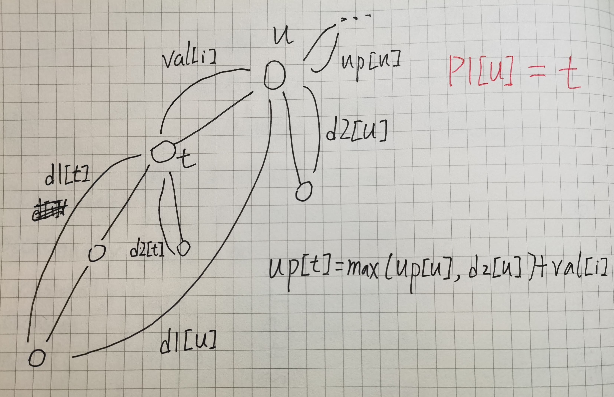
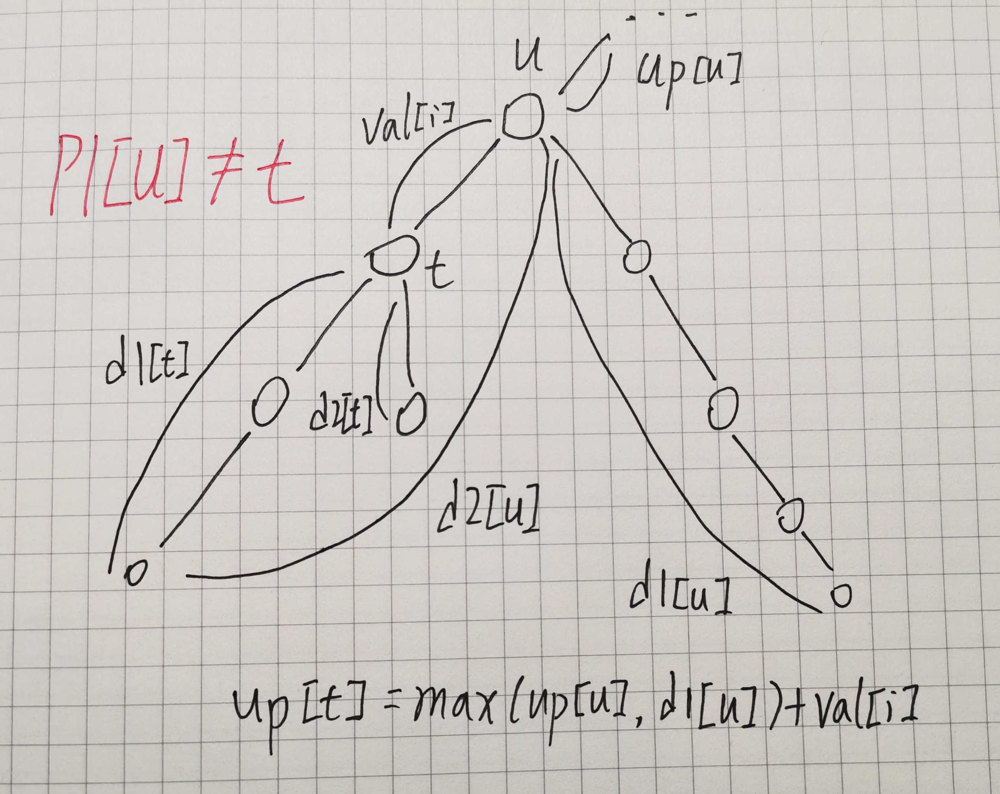

# 1073. 树的中心

给定一棵树，树中包含 n 个结点（编号1~n）和 n−1 条无向边，每条边都有一个权值。

请你在树中找到一个点，使得该点到树中**其他结点的最远距离最近**。

#### 输入格式

第一行包含整数 n。

接下来 n−1 行，每行包含三个整数 ai,bi,ci，表示点 ai 和 bi 之间存在一条权值为 ci 的边。

#### 输出格式

输出一个整数，表示所求点到树中其他结点的最远距离。

#### 数据范围

1≤n≤10000, 1≤ai,bi≤n, 1≤ci≤105

#### 输入样例：

```
5 
2 1 1 
3 2 1 
4 3 1 
5 1 1
```

#### 输出样例：

```
2
```


## DFS





```java
import java.util.*;
import java.io.*;

class Main {
    static int N, maxN = 100010, maxM = 2*maxN, INF = 0x3f3f3f3f;
    static int[] info = new int[maxN];
    static int[] from = new int[maxM], to = new int[maxM], val = new int[maxM];
    static int[] d1 = new int[maxN], d2 = new int[maxN], p1 = new int[maxN], up = new int[maxN];
    static int idx = 0;

    public static void main(String[] args) throws IOException {
        BufferedReader br = new BufferedReader(new InputStreamReader(System.in));
        N = Integer.parseInt(br.readLine().trim());

        Arrays.fill(info, -1);
        for (int i = 1; i < N; i++) {
            String[] str = br.readLine().split(" ");
            int a = Integer.parseInt(str[0]);
            int b = Integer.parseInt(str[1]);
            int c = Integer.parseInt(str[2]);
            add(a, b, c); add(b, a, c);
        }

        dfs_dn(1, -1);
        dfs_up(1, -1);
        
        int res = INF;
        for (int i = 1; i <= N; i++) res = Math.min(res, Math.max(d1[i], up[i]));
        System.out.println(res);
    }

    private static int dfs_dn(int u, int p) {
        d1[u] = d2[u] = 0;
        for (int i = info[u]; i != -1; i = from[i]) {
            int t = to[i];
            if (t == p) continue;

            int dis = dfs_dn(t, u) + val[i];
            if (dis > d1[u]) {
                d2[u] = d1[u]; 
                d1[u] = dis; p1[u] = t;
            } else if (dis > d2[u]) {
                d2[u] = dis;
            }
        }
        return d1[u];
    }

    private static void dfs_up(int u, int p) {
        for (int i = info[u]; i != -1; i = from[i]) {
            int t = to[i];
            if (t == p) continue;
			// 注意这里数组的下标
            if (p1[u] == t) up[t] = Math.max(up[u], d2[u]) + val[i];
            else            up[t] = Math.max(up[u], d1[u]) + val[i];

            dfs_up(t, u);
        }
    }

    private static void add(int a, int b, int c) {
        from[idx] = info[a];
        to[idx] = b;
        val[idx] = c;
        info[a] = idx++;
    }
}
```

