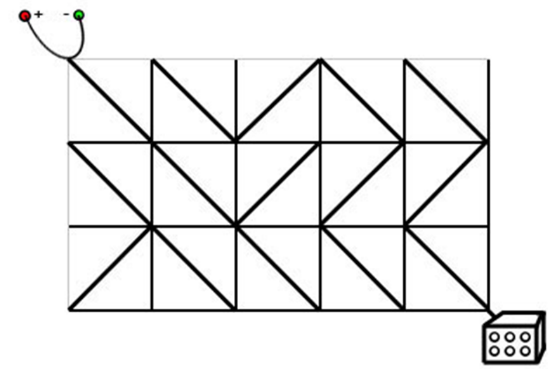

# 175. 电路维修

达达是来自异世界的魔女，她在漫无目的地四处漂流的时候，遇到了善良的少女翰翰，从而被收留在地球上。

翰翰的家里有一辆飞行车。

有一天飞行车的电路板突然出现了故障，导致无法启动。

电路板的整体结构是一个R行C列的网格（R,C≤500），如下图所示。



每个格点都是电线的接点，每个格子都包含一个电子元件。

电子元件的主要部分是一个可旋转的、连接一条对角线上的两个接点的短电缆。

在旋转之后，它就可以连接另一条对角线的两个接点。

电路板左上角的接点接入直流电源，右下角的接点接入飞行车的发动装置。

达达发现因为某些元件的方向不小心发生了改变，电路板可能处于断路的状态。

她准备通过计算，旋转最少数量的元件，使电源与发动装置通过若干条短缆相连。

不过，电路的规模实在是太大了，达达并不擅长编程，希望你能够帮她解决这个问题。

**注意**：只能走斜向的线段，水平和竖直线段不能走。

#### 输入格式

输入文件包含多组测试数据。

第一行包含一个整数T，表示测试数据的数目。

对于每组测试数据，第一行包含正整数R和C，表示电路板的行数和列数。

之后R行，每行C个字符，字符是`"/"`和`"\"`中的一个，表示标准件的方向。

#### 输出格式

对于每组测试数据，在单独的一行输出一个正整数，表示所需的缩小旋转次数。

如果无论怎样都不能使得电源和发动机之间连通，输出NO SOLUTION。

#### 数据范围

1≤R,C≤5001≤R,C≤500,
1≤T≤51≤T≤5

#### 输入样例：

```
1
3 5
\\/\\
\\///
/\\\\
```

#### 输出样例：

```
1
```

## 双向队列 + BFS
我们要考虑的是最后到终点的距离，终点是（R，C），起点是（0，0）；
注意终点不是最后一个单元格，而是最后一个角（即最后一个单元格的右下角）。
所以，我们并不是按单元格来计算距离，而是按两个直线相交的角来计算。
所以，我的dp\[i]\[j].表示的是（0，0）到（i，j）这个**角**的最少距离是多少。
同时我们需要考虑的是（0，0）到（i，j）这个角经过的单元格里面的‘/’和‘\’。
想象一下这个过程，如果我要从（0，0）到（1，1）这个角。那我经过的单元格就是Graph\[1]\[1]，同时（0，0）到（1，1）这个角应该是‘\’。所以我们判断一下Graph\[1]\[1]是否等于’\ ‘。如果是，则距离为0，不然为1.
再考虑一下（1，1）到（2，0）这个角。我经过的单元格应该是Graph\[2]\[1]，同时，这个单元格里面的内容应该为’/’。如果是，则距离为0，不然为1.
同理，其他方向。
最后，这差不多就是一个朴素最短路问题了。

```java
import java.util.*;

public class Main{
    static int R, C, maxN = 510, INF = 0x3f3f3f3f;
    static char[][] graph = new char[maxN][maxN];
    static int[][] dp = new int[maxN][maxN];
    static boolean[][] vis;
    static int[] dx1 = { 1,-1,-1, 1}, dy1 = { 1,-1, 1,-1};
    static int[] dx2 = { 1, 0, 0, 1}, dy2 = { 1, 0, 1, 0};

    public static void main(String[] args) {
        Scanner sc = new Scanner(System.in);
        int T = sc.nextInt();
        while (T-- > 0) {
            for (char[] g : graph) Arrays.fill(g, ' ');
            for (int[] d : dp) Arrays.fill(d, INF);
            vis = new boolean[maxN][maxN];

            R = sc.nextInt(); C = sc.nextInt();
            sc.nextLine();
            for (int i = 1; i <= R; i++) {
                char[] c = sc.nextLine().toCharArray();
                System.arraycopy(c, 0, graph[i], 1, C);
            }

            bfs();

            if (dp[R][C] == INF) System.out.println("NO SOLUTION");
            else System.out.println(dp[R][C]);
        }
    }

    private static void bfs() {
        Deque<int[]> deque = new ArrayDeque<>();
        deque.add(new int[]{0, 0});
        dp[0][0] = 0;
        while (!deque.isEmpty()) {
            int[] tmp = deque.pollFirst();
            int x = tmp[0], y = tmp[1];
            if (vis[x][y]) continue;
            vis[x][y] = true;
            for (int i = 0; i < 4; i++) {
                int tx = dx1[i] + x, ty = dy1[i] + y;
                int gx = dx2[i] + x, gy = dy2[i] + y;
                if (cross(tx, ty)) continue;
                int s = graph[gx][gy] == (i <= 1 ? '\\' : '/') ? 0 : 1;
                if (dp[tx][ty] <= dp[x][y]+s) continue;
                dp[tx][ty] = dp[x][y] + s;
                if (s == 0) deque.addFirst(new int[]{tx, ty});
                else deque.addLast(new int[]{tx, ty});
            }
        }
    }

    private static boolean cross(int tx, int ty) {
        return tx < 0 || tx > R || ty < 0 || ty > C;
    }
}
```

