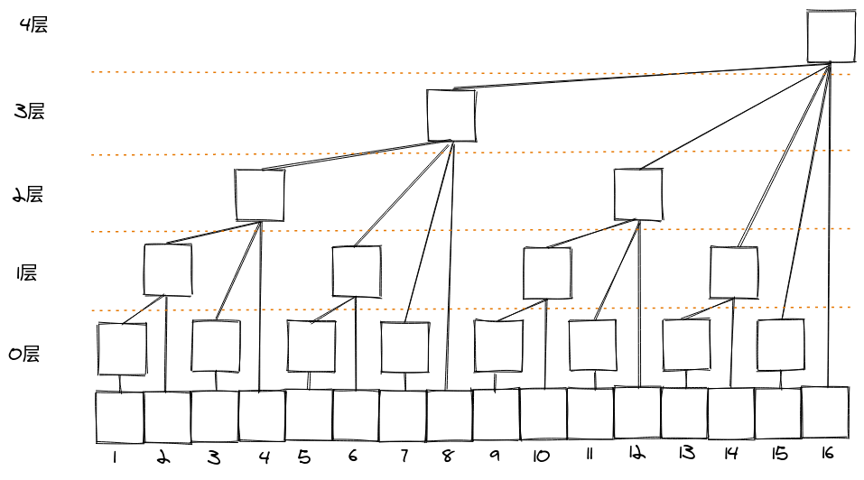
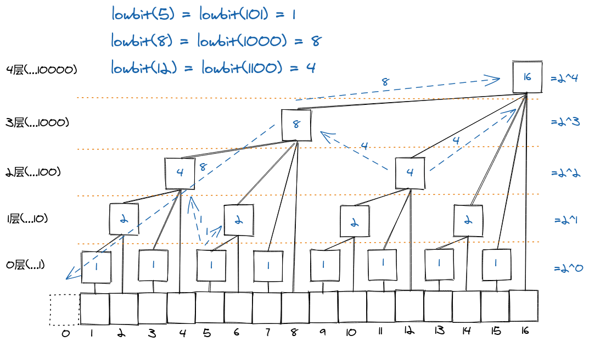
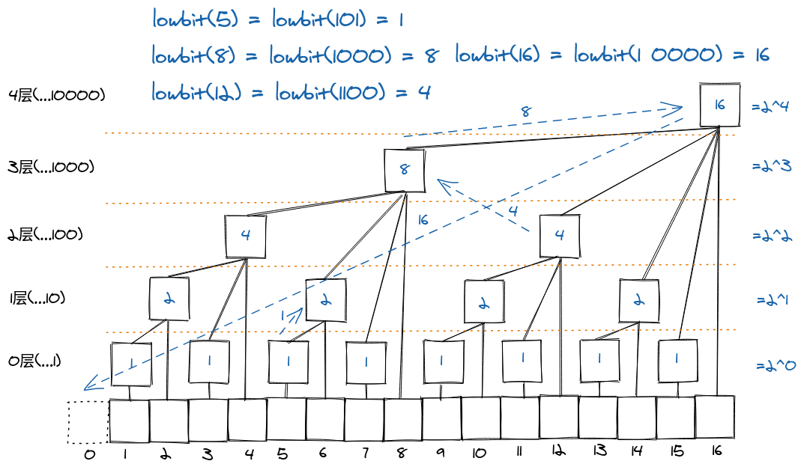

# 树状数组（Binary Indexed Tree）

如图可知：
>C1 = A1
C2 = C1 + A2 = A1 + A2
C3 = A3
C4 = C2 + C3 + A4 = A1 + A2 + A3 + A4
C5 = A5
C6 = C5 + A6 = A5 + A6
C7 = A7
C8 = C4 + C6 + C7 + A8 = A1 + A2 + A3 + A4 + A5 + A6 + A7 + A8
...

**C[x] 储存的是 (x - lowbit(x), x] 之间的前缀和**

## Sample Demo
```java
class BinaryIndexTree {
    int[] pre_sum;

    public BinaryIndexTree(int[] arr) {
        pre_sum = new int[arr.length+1];
        for(int i = 0; i < arr.length; i++) {
            update(i+1, arr[i]);	// 下标必须从 1 开始!!!         
        }
    }

    // 返回最低位的 1（的值）
    private int lowbit(int x) {
        // x & (x ^ (x-1));
    	return x & (-x);	// -x 的值， 其实就是在x的值的基础上进行按位取反(~x)之后在增加1所得
    }

    // 更新idx的值 (pre_sum里有多个值会被修改)
    private void update(int idx, int x) {
        while (idx <= pre_sum.length) {
            pre_sum[idx] += x;
            idx += lowbit(idx);
        }
    }

    // 0~idx的前缀和
    private int query(int idx) {
        int res = 0;
        while (idx > 0) {
            res += pre_sum[idx];
            idx -= lowbit(idx);
        }
        return res;
    }
}
```

**理解 lowbit() ：**
- update() 对应向后的箭头
- query() 对应向前的箭头


