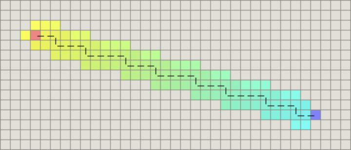
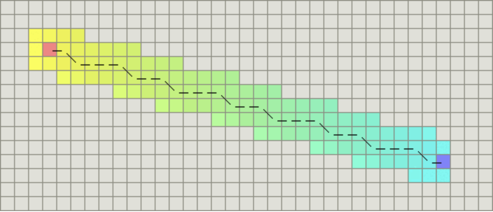

### 搜索区域(The Search Area)

我们假设某人要从 A 点移动到 B 点，但是这两点之间被一堵墙隔开。如图 1 ，绿色是 A ，红色是 B ，中间蓝色是墙。


数组的每一项代表一个格子，它的状态就是可走 (walkalbe) 和不可走 (unwalkable) 。通过计算出从 A 到 B需要走过哪些方格，就找到了路径。一旦路径找到了，人物便从一个方格的中心移动到另一个方格的中心，直至到达目的地。

方格的中心点我们成为“节点 (nodes) ”。为什么不直接描述为方格呢？因为我们有可能把搜索区域划为为其他多变形而不是正方形，例如可以是六边形，矩形，甚至可以是任意多变形。而节点可以放在任意多边形里面，可以放在多变形的中心，也可以放在多边形的边上。我们使用这个系统，因为它最简单。

### 开始搜索(Starting the Search)

一旦我们把搜寻区域简化为一组可以量化的节点后，就像上面做的一样，我们下一步要做的便是查找最短路径。在 A* 中，我们从起点开始，检查其相邻的方格，然后向四周扩展，直至找到目标。

我们这样开始我们的寻路旅途：

1. 从起点 A 开始，并把它就加入到一个由方格组成的 open list 中。这个 open list 有点像是一个购物单。当然现在 open list 里只有一项，它就是起点 A ，后面会慢慢加入更多的项。 Open list 里的格子是路径可能会是沿途经过的，也有可能不经过。基本上 open list 是一个待检查的方格列表。

2. 查看与起点 A 相邻的方格 ( 忽略其中墙壁及其他非法地形的方格 ) ，把其中可走的 (walkable) 或可到达的 (reachable) 方格也加入到 open list 中。把起点 A 设置为这些方格的父亲 (parent node 或 parent square) 。当我们在追踪路径时，这些父节点的内容是很重要的。稍后解释。

3. 把 A 从 open list 中移除，加入到 close list 中， close list 中的每个方格都是现在不需要再关注的。

如下图所示，深绿色的方格为起点，它的外框是亮蓝色，表示该方格被加入到了 close list 。与它相邻的黑色方格是需要被检查的，他们的外框是亮绿色。每个黑方格都有一个灰色的指针指向他们的父节点，这里是起点 A 。


下一步，我们需要从 open list 中选一个与起点 A 相邻的方格，按下面描述的一样或多或少的重复前面的步骤。但是到底选择哪个方格好呢？具有最小 F 值的那个。

 

### 路径排序(Path Sorting)

计算出组成路径的方格的关键是下面这个等式：

F = G + H

这里，

G = 从起点 A 移动到指定方格的移动代价，沿着到达该方格而生成的路径。

H = 从指定的方格移动到终点 B 的估算成本。这个通常被称为试探法，有点让人混淆。为什么这么叫呢，因为这是个猜测。直到我们找到了路径我们才会知道真正的距离，因为途中有各种各样的东西 ( 比如墙壁，水等 ) 。本教程将教你一种计算 H 的方法，你也可以在网上找到其他方法。

我们的路径是这么产生的：反复遍历 open list ，选择 F 值最小的方格。这个过程稍后详细描述。我们还是先看看怎么去计算上面的等式。

如上所述， G 是从起点Ａ移动到指定方格的移动代价。在本例中，横向和纵向的移动代价设为 10 ，对角线的移动代价设为 14 。

既然我们是沿着到达指定方格的路径来计算 G 值，那么计算出该方格的 G 值的方法就是找出其父亲的 G 值，然后按父亲是直线方向还是斜线方向加上 10 或 14 。随着我们离开起点而得到更多的方格，这个方法会变得更加明朗。

 

有很多方法可以估算 H 值。这里我们使用 Manhattan 方法，计算从当前方格横向或纵向移动到达目标所经过的方格数，忽略对角移动，然后把总数乘以 10 。之所以叫做 Manhattan 方法，是因为这很像统计从一个地点到另一个地点所穿过的街区数，而你不能斜向穿过街区。重要的是，计算 H 是，要忽略路径中的障碍物。这是对剩余距离的估算值，而不是实际值，因此才称为试探法。

 

把 G 和 H 相加便得到 F 。我们第一步的结果如下图所示。每个方格都标上了 F ， G ， H 的值，就像起点右边的方格那样，左上角是 F ，左下角是 G ，右下角是 H 。


好，现在让我们看看其中的一些方格。在标有字母的方格， G = 10 。这是因为水平方向从起点到那里只有一个方格的距离。与起点直接相邻的上方，下方，左方的方格的 G 值都是 10 ，对角线的方格 G 值都是 14 。 

H 值通过估算起点于终点 ( 红色方格 ) 的 Manhattan 距离得到，仅作横向和纵向移动，并且忽略沿途的墙壁。使用这种方式，起点右边的方格到终点有 3 个方格的距离，因此 H = 30 。这个方格上方的方格到终点有 4 个方格的距离 ( 注意只计算横向和纵向距离 ) ，因此 H = 40 。对于其他的方格，你可以用同样的方法知道 H 值是如何得来的。

每个方格的 F 值，再说一次，直接把 G 值和 H 值相加就可以了。

 

### 继续搜索(Continuing the Search)

为了继续搜索，我们从 open list 中选择 F 值最小的 ( 方格 ) 节点，然后对所选择的方格作如下操作：

4. 把它从 open list 里取出，放到 close list 中。

5. 检查所有与它相邻的方格，忽略其中在 close list 中或是不可走 (unwalkable) 的方格 ( 比如墙，水，或是其他非法地形 ) ，如果方格不在open lsit 中，则把它们加入到 open list 中。把我们选定的方格设置为这些新加入的方格的父亲。

6. 如果某个相邻的方格已经在 open list 中，则检查这条路径是否更优，也就是说经由当前方格 ( 我们选中的方格 ) 到达那个方格是否具有更小的 G 值。如果没有，不做任何操作。

相反，如果 G 值更小，则把那个方格的父亲设为当前方格 ( 我们选中的方格 ) ，然后重新计算那个方格的 F 值和 G 值。如果你还是很混淆，请参考下图。


Ok ，让我们看看它是怎么工作的。在我们最初的 9 个方格中，还有 8 个在 open list 中，起点被放入了 close list 中。在这些方格中，起点右边的格子的 F 值 40 最小，因此我们选择这个方格作为下一个要处理的方格。它的外框用蓝线打亮。

 

首先，我们把它从 open list 移到 close list 中 ( 这就是为什么用蓝线打亮的原因了 ) 。然后我们检查与它相邻的方格。它右边的方格是墙壁，我们忽略。它左边的方格是起点，在 close list 中，我们也忽略。其他 4 个相邻的方格均在 open list 中，我们需要检查经由这个方格到达那里的路径是否更好，使用 G 值来判定。让我们看看上面的方格。它现在的 G 值为 14 。如果我们经由当前方格到达那里， G 值将会为 20(其中 10 为到达当前方格的 G 值，此外还要加上从当前方格纵向移动到上面方格的 G 值 10) 。显然 20 比 14 大，因此这不是最优的路径。如果你看图你就会明白。直接从起点沿对角线移动到那个方格比先横向移动再纵向移动要好。

 

当把 4 个已经在 open list 中的相邻方格都检查后，没有发现经由当前方格的更好路径，因此我们不做任何改变。现在我们已经检查了当前方格的所有相邻的方格，并也对他们作了处理，是时候选择下一个待处理的方格了。

 

因此再次遍历我们的 open list ，现在它只有 7 个方格了，我们需要选择 F 值最小的那个。有趣的是，这次有两个方格的 F 值都 54 ，选哪个呢？没什么关系。从速度上考虑，选择最后加入 open list 的方格更快。这导致了在寻路过程中，当靠近目标时，优先使用新找到的方格的偏好。但是这并不重要。 ( 对相同数据的不同对待，导致两中版本的 A* 找到等长的不同路径 ) 。

 

我们选择起点右下方的方格，如下图所示。


 

这次，当我们检查相邻的方格时，我们发现它右边的方格是墙，忽略之。上面的也一样。

我们把墙下面的一格也忽略掉。为什么？因为如果不穿越墙角的话，你不能直接从当前方格移动到那个方格。你需要先往下走，然后再移动到那个方格，这样来绕过墙角。 ( 注意：穿越墙角的规则是可选的，依赖于你的节点是怎么放置的 )

这样还剩下 5 个相邻的方格。当前方格下面的 2 个方格还没有加入 open list ，所以把它们加入，同时把当前方格设为他们的父亲。在剩下的3 个方格中，有 2 个已经在 close list 中 ( 一个是起点，一个是当前方格上面的方格，外框被加亮的 ) ，我们忽略它们。最后一个方格，也就是当前方格左边的方格，我们检查经由当前方格到达那里是否具有更小的 G 值。没有。因此我们准备从 open list 中选择下一个待处理的方格。

不断重复这个过程，直到把终点也加入到了 open list 中，此时如下图所示。


 

注意，在起点下面 2 格的方格的父亲已经与前面不同了。之前它的 G 值是 28 并且指向它右上方的方格。现在它的 G 值为 20 ，并且指向它正上方的方格。这在寻路过程中的某处发生，使用新路径时 G 值经过检查并且变得更低，因此父节点被重新设置， G 和 F 值被重新计算。尽管这一变化在本例中并不重要，但是在很多场合中，这种变化会导致寻路结果的巨大变化。

那么我们怎么样去确定实际路径呢？很简单，从终点开始，按着箭头向父节点移动，这样你就被带回到了起点，这就是你的路径。如下图所示。从起点 A 移动到终点 B 就是简单从路径上的一个方格的中心移动到另一个方格的中心，直至目标。就是这么简单！


 

### A\*算法总结(Summary of the A* Method)

Ok ，现在你已经看完了整个的介绍，现在我们把所有步骤放在一起：

1. 把起点加入 open list 。

2. 重复如下过程：

   a. 遍历 open list ，查找 F 值最小的节点，把它作为当前要处理的节点。

   b. 把这个节点移到 close list 。

   c. 对当前方格的 8 个相邻方格的每一个方格？

   ​	◆   如果它是不可抵达的或者它在 close list 中，忽略它。否则，做如下操作:

   ​	◆   如果它不在 open list 中，把它加入 open list ，并且把当前方格设置为它的父亲，记录该方格的 F ， G 和 H 值。

   ​	◆   如果它已经在 open list 中，检查这条路径 ( 即经由当前方格到达它那里 ) 是否更好，用 G 值作参考。更小的 G 值表示这是更好的路径。如果是这样，把它的父亲设置为当前方格，并重新计算它的 G 和 F 值。如果你的 open list 是按 F 值排序的话，改变后你可能需要重新排序。

   d. 停止，当你

   ​	◆   把终点加入到了 open list 中，此时路径已经找到了，或者

   ​	◆   查找终点失败，并且 open list 是空的，此时没有路径。

3. 保存路径。从终点开始，每个方格沿着父节点移动直至起点，这就是你的路径。


### 启发函数

上面已经提到，启发函数会影响A*算法的行为。

- 在极端情况下，当启发函数h(n)始终为0，则将由g(n)决定节点的优先级，此时算法就退化成了Dijkstra算法。
- 如果h(n)始终小于等于节点n到终点的代价，则A*算法保证一定能够找到最短路径。但是当h(n)的值越小，算法将遍历越多的节点，也就导致算法越慢。
- 如果h(n)完全等于节点n到终点的代价，则A*算法将找到最佳路径，并且速度很快。可惜的是，并非所有场景下都能做到这一点。因为在没有达到终点之前，我们很难确切算出距离终点还有多远。
- 如果h(n)的值比节点n到终点的代价要大，则A*算法不能保证找到最短路径，不过此时会很快。
- 在另外一个极端情况下，如果h()n相较于g(n)大很多，则此时只有h(n)产生效果，这也就变成了最佳优先搜索。

由上面这些信息我们可以知道，通过调节启发函数我们可以控制算法的速度和精确度。因为在一些情况，我们可能未必需要最短路径，而是希望能够尽快找到一个路径即可。这也是A*算法比较灵活的地方。

对于网格形式的图，有以下这些启发函数可以使用：

- 如果图形中只允许朝上下左右四个方向移动，则可以使用曼哈顿距离（Manhattan distance）。
- 如果图形中允许朝八个方向移动，则可以使用对角距离。
- 如果图形中允许朝任何方向移动，则可以使用欧几里得距离（Euclidean distance）。

### 关于距离

**曼哈顿距离**

如果图形中只允许朝上下左右四个方向移动，则启发函数可以使用曼哈顿距离，它的计算方法如下图所示：





计算曼哈顿距离的函数如下，这里的D是指两个相邻节点之间的移动代价，通常是一个固定的常数。

```text
function heuristic(node) =
    dx = abs(node.x - goal.x)
    dy = abs(node.y - goal.y)
    return D * (dx + dy)
```

**对角距离**

如果图形中允许斜着朝邻近的节点移动，则启发函数可以使用对角距离。它的计算方法如下：





计算对角距离的函数如下，这里的D2指的是两个斜着相邻节点之间的移动代价。如果所有节点都正方形，则其值就是


```text
function heuristic(node) =
    dx = abs(node.x - goal.x)
    dy = abs(node.y - goal.y)
    return D * (dx + dy) + (D2 - 2 * D) * min(dx, dy)
```

**欧几里得距离**

如果图形中允许朝任意方向移动，则可以使用欧几里得距离。

欧几里得距离是指两个节点之间的直线距离，因此其计算方法也是我们比较熟悉的：


其函数表示如下：

```text
function heuristic(node) =
    dx = abs(node.x - goal.x)
    dy = abs(node.y - goal.y)
    return D * sqrt(dx * dx + dy * dy)
```

 

## 例题

### 第K短路

```java
import java.util.*;

class Main {
    static int maxN = 1010, maxM = 200010, INF = 0x3f3f3f3f;
    static int[] from = new int[maxN], to = new int[maxN];
    static int[] val = new int[maxM], info = new int[maxM], rnfo = new int[maxM];
    static int[] dist = new int[maxN], f = new int[maxN], st = new int[maxN];
    static int idx = 0;
    static int N, M, S, E, K;

    public static void main(String[] args) {
        Scanner sc = new Scanner(System.in);
        N = sc.nextInt();
        M = sc.nextInt();
        Arrays.fill(info, -1); Arrays.fill(rnfo, -1);
        while (M-- > 0) {
            int a = sc.nextInt();
            int b = sc.nextInt();
            int c = sc.nextInt();
            add(0, a, b, c);
            add(1, a, b, c);
        }
        S = sc.nextInt(); E = sc.nextInt(); K = sc.nextInt();
        if (S == E) K++;

        dijkstra();
        System.out.println(aStar());
    }

    private static int aStar() {
        PriorityQueue<PIII> heap = new PriorityQueue<>((a, b) -> (b.val - a.val));
        heap.add(new PIII(f[S], new PII(0, S)));
        Arrays.fill(st, 0);

        while (!heap.isEmpty()) {
            PIII cur = heap.poll();
            int idx = cur.pii.idx, dis = cur.pii.dis;
            if (st[idx] >= K) continue;
            st[idx]++;

            if (idx == E && st[idx] == K) return dis;
            for (int i = info[idx]; i != 0; i = from[i]) {
                int t = to[i];
                if (st[t] < K) {
                    heap.add(new PIII(dis+val[i]+f[t], new PII(dis+val[i], t)));
                }
            }
        }

        return -1;
    }

    private static void dijkstra() {
        PriorityQueue<PII> heap = new PriorityQueue<>((a, b) -> (b.dis - a.dis));
        heap.add(new PII(0, E));
        Arrays.fill(dist, INF);
        dist[E] = 0;

        while (!heap.isEmpty()) {
            PII cur = heap.poll();
            if (st[cur.idx] == 1) continue;
            st[cur.idx] = 1;

            for (int i = rnfo[cur.idx]; i != 0; i = from[cur.idx]) {
                int t = to[cur.idx];
                if (dist[t] > dist[cur.idx] + val[i]) {
                    heap.add(new PII(dist[t], t));
                }
            }
        }

        System.arraycopy(dist, 0, f, 0, maxN);
    }

    private static void add(int r, int a, int b, int c) {
        to[idx] = b;
        val[idx] = c;
        if (r == 0) {
            from[idx] = info[a];
            info[a] = idx++;
        } else {
            from[idx] = rnfo[a];
            rnfo[a] = idx++;
        }
    }

    private static class PII {
        int dis, idx;

        public PII(int d, int i) {
            dis = d;
            idx = i;
        }
    }

    private static class PIII {
        int val;
        PII pii;

        public PIII(int v, PII p) {
            val = v;
            pii = p;
        }
    }
}
```

### 八数码

```cpp
#include <iostream>
#include <cstring>
#include <queue>
#include <unordered_map>
#include <algorithm>

using namespace std;
typedef pair<int, string> PIS;

unordered_map<string , int> dist;
unordered_map<string , pair<string , char>> pre;
priority_queue<PIS , vector<PIS> , greater<PIS>> heap;
string ed = "12345678x";
int dx[4] = {-1, 0, 1, 0};
int dy[4] = { 0, 1, 0,-1};
char dir[] = "urdl";

int getDist(string state) {   // 求估值函数,这里是曼哈顿距离
    int res = 0;
    for(int i = 0; i < 9; i++) {
        if(state[i] != 'x') {
            int t = state[i] - '1';
            res += abs(t/3-i/3) + abs(t%3-i%3);
        }
    }
    return res;
}

string bfs(string start) {
    heap.push({getDist(start) , start});
    dist[start] = 0;

    while (heap.size()) {
        auto t = heap.top();
        heap.pop();

        string state = t.second;
        if(state == ed) break;  // 如果到达终点就break
        int step = dist[state]; // 记录到达state的实际距离

        int k = state.find('x');// 确定当前 'x' 的位置
        int x = k / 3 , y = k % 3;

        string backup = state;  // 因为在下面state会变，所以留一个备份
        for (int i = 0; i < 4; i++) {
            int tx = x + dx[i], ty = y + dy[i];
            if (tx >= 0 && tx < 3 && ty >= 0 && ty < 3) {
                swap(state[x*3+y], state[tx*3+ty]);
                if (!dist.count(state) || dist[state] > step + 1) {
                    dist[state] = step + 1;
                    pre[state] = {backup, dir[i]};
                    heap.push({ dist[state] + getDist(state), state });
                }
                swap(state[x * 3 + y], state[tx * 3 + ty]);   // 因为要多次交换，所以要恢复现场
            }
        }

    }

    string res;
    while (ed != start) {
        res += pre[ed].second;
        ed = pre[ed].first;
    }
    reverse(res.begin() , res.end());
    return res;
}

int main() {
    string init;
    for (int i = 0; i < 9; i++) {
        char c;
        cin >> c;
        init += c;
    }

    int cnt = 0;
    for(int i = 0; i < 9; i++) {
        if (init[i] == 'x') continue;
        for(int j = i+1; j < 8; j++) {
            if (init[j] == 'x') continue;
            if(init[i] > init[j]) cnt++;             
        }
    }

    if(cnt % 2) puts("unsolvable");
    else cout<<bfs(init)<<endl;

    return 0;
}
```

