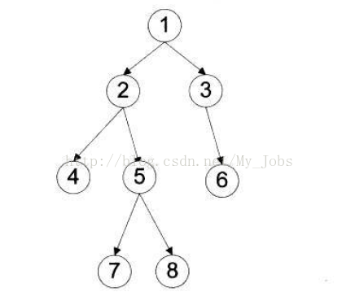

# 二叉树遍历（前序、中序、后序、层次遍历、深度优先、广度优先）

二叉树是一种非常重要的数据结构，很多其它数据结构都是基于二叉树的基础演变而来的。对于二叉树，有深度遍历和广度遍历，深度遍历有前序、中序以及后序三种遍历方法，广度遍历即我们平常所说的层次遍历。因为树的定义本身就是递归定义，因此采用递归的方法去实现树的三种遍历不仅容易理解而且代码很简洁，而对于广度遍历来说，需要其他数据结构的支撑，比如堆了。所以，对于一段代码来说，可读性有时候要比代码本身的效率要重要的多。

四种主要的遍历思想为：

前序遍历：根结点 ---> 左子树 ---> 右子树

中序遍历：左子树---> 根结点 ---> 右子树

后序遍历：左子树 ---> 右子树 ---> 根结点

层次遍历：只需按层次遍历即可

例如，求下面二叉树的各种遍历



前序遍历：1  2  4  5  7  8  3  6 

中序遍历：4  2  7  5  8  1  3  6

后序遍历：4  7  8  5  2  6  3  1

层次遍历：1  2  3  4  5  6  7  8

## 一、前序遍历

1）根据上文提到的遍历思路：根结点 ---> 左子树 ---> 右子树，很容易写出递归版本：

```java
public void preOrderTraverse1(TreeNode root) {
    if (root != null) {
        System.out.print(root.val+"  ");
        preOrderTraverse1(root.left);
        preOrderTraverse1(root.right);
    }
}
```


2）非递归的版本：

根据前序遍历的顺序，优先访问根结点，然后在访问左子树和右子树。所以，对于任意结点node，第一部分即直接访问之，之后在判断左子树是否为空，不为空时即重复上面的步骤，直到其为空。若为空，则需要访问右子树。注意，在访问过左孩子之后，需要反过来访问其右孩子，所以，需要栈这种数据结构的支持。对于任意一个结点node，具体步骤如下：

a)访问之，并把结点node入栈，当前结点置为左孩子；

b)判断结点node是否为空，若为空，则取出栈顶结点并出栈，将右孩子置为当前结点；否则重复a)步直到当前结点为空或者栈为空（可以发现栈中的结点就是为了访问右孩子才存储的）

代码如下：

```java
public void preOrderTraverse2(TreeNode root) {
    LinkedList<TreeNode> stack = new LinkedList<>();
    TreeNode pNode = root;
    while (pNode != null || !stack.isEmpty()) {
        if (pNode != null) {
            System.out.print(pNode.val+"  ");
            stack.push(pNode);
            pNode = pNode.left;
        } else { //pNode == null && !stack.isEmpty()
            TreeNode node = stack.pop();
            pNode = node.right;
        }
    }
}
```


## 二、中序遍历

1）根据上文提到的遍历思路：左子树 ---> 根结点 ---> 右子树，很容易写出递归版本：

```java
public void inOrderTraverse1(TreeNode root) {
    if (root != null) {
        inOrderTraverse1(root.left);
        System.out.print(root.val+"  ");
        inOrderTraverse1(root.right);
    }
}
```


2）非递归实现，有了上面前序的解释，中序也就比较简单了，相同的道理。只不过访问的顺序移到出栈时。代码如下：

```java
public void inOrderTraverse2(TreeNode root) {
    LinkedList<TreeNode> stack = new LinkedList<>();
    TreeNode pNode = root;
    while (pNode != null || !stack.isEmpty()) {
        if (pNode != null) {
            stack.push(pNode);
            pNode = pNode.left;
        } else { // pNode == null && !stack.isEmpty()
            TreeNode node = stack.pop();
            System.out.print(node.val+"  ");
            pNode = node.right;
        }
    }
}
```


## 三、后序遍历

1）根据上文提到的遍历思路：左子树 ---> 右子树 ---> 根结点，很容易写出递归版本：

```java
public void postOrderTraverse1(TreeNode root) {
    if (root != null) {
        postOrderTraverse1(root.left);
        postOrderTraverse1(root.right);
        System.out.print(root.val+"  ");
    }
}
```

2）非递归的代码

略

## 四、广度优先遍历（层次遍历）

层次遍历的代码比较简单，只需要一个队列即可，先在队列中加入根结点。之后对于任意一个结点来说，在其出队列的时候，访问之。同时如果左孩子和右孩子有不为空的，入队列。代码如下：


```java
public void levelTraverse(TreeNode root) {
    if (root == null) return;

    LinkedList<TreeNode> queue = new LinkedList<>();
    queue.offer(root);
    while (!queue.isEmpty()) {
        TreeNode node = queue.poll();
        System.out.print(node.val+"  ");
        
        if (node.left != null) {
            queue.offer(node.left);
        }
        if (node.right != null) {
            queue.offer(node.right);
        }
    }
}
```


## 五、深度优先遍历

其实深度遍历就是上面的前序、中序和后序。但是为了保证与广度优先遍历相照应，也写在这。代码也比较好理解，其实就是前序遍历，代码如下：

```java
public void depthOrderTraverse(TreeNode root) {
		if (root == null) return;

		LinkedList<TreeNode> stack = new LinkedList<>();
		stack.push(root);
		while (!stack.isEmpty()) {
			TreeNode node = stack.pop();
			System.out.print(node.val+"  ");
            
			if (node.right != null) {
				stack.push(node.right);
			}
			if (node.left != null) {
				stack.push(node.left);
			}
		}
	}
}
```


