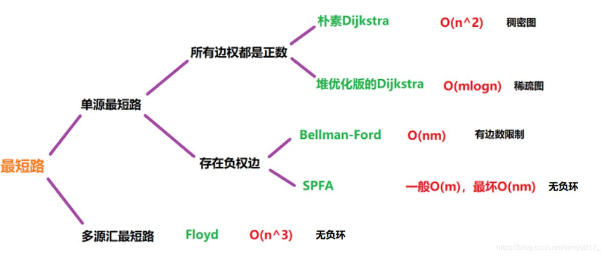
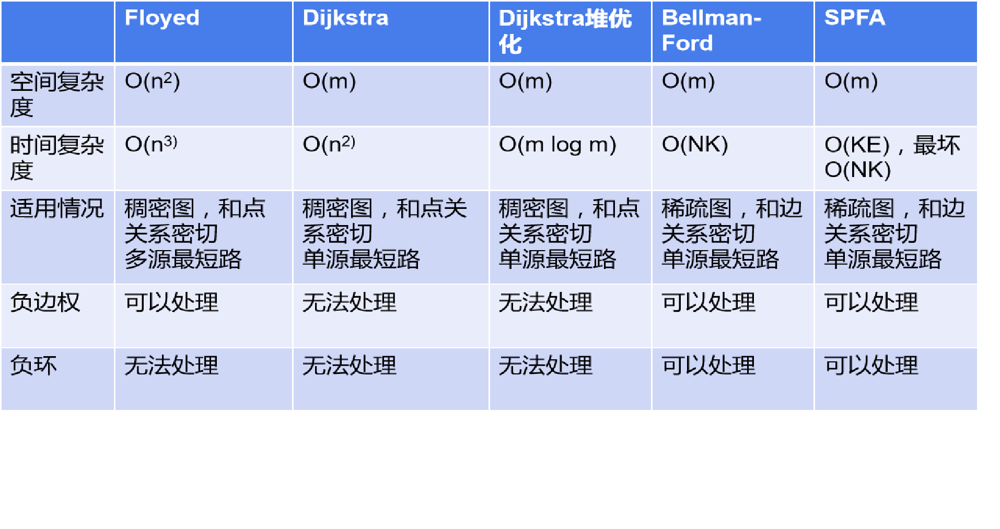
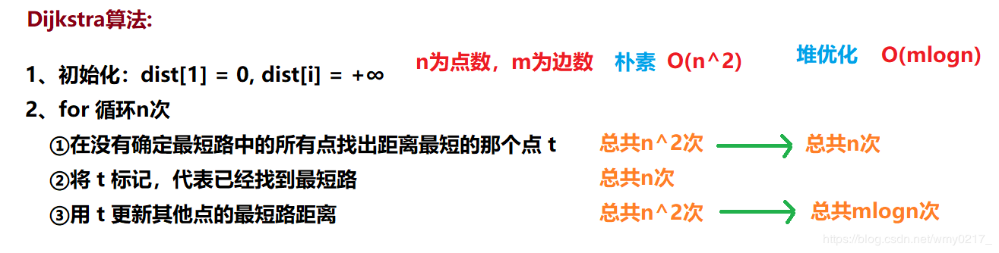
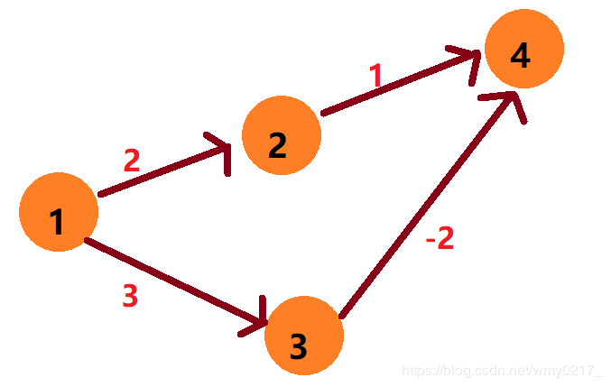
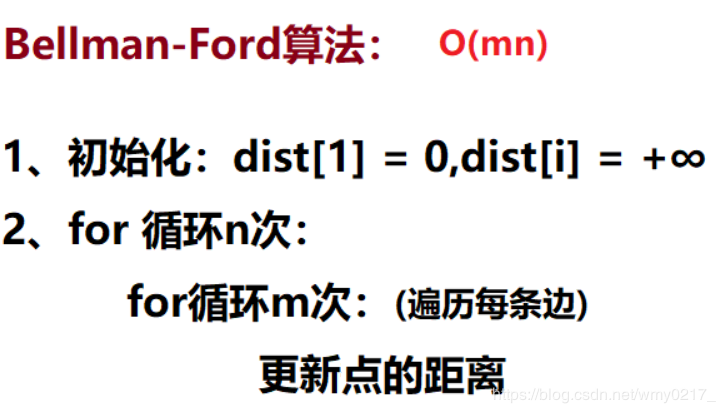

# 最短路算法总结
### 最短路算法框架


单源最短路： 求一个点到其他点的最短路
多源最短路： 求任意两个点的最短路

稠密图用邻接矩阵存储，稀疏图用邻接表存储。
稠密图： m 和 n^2^ 一个级别
稀疏图： m 和 n 一个级别

### 朴素Dijkstra算法


首先找到一个没有确定最短路且距离起点最近的点，并通过这个点将其他点的最短距离进行更新。每做一次这个步骤，都能确定一个点的最短路，所以需要重复此步骤 n 次，找出 n 个点的最短路。

**核心代码**
```java
private static int[] dijkstra(int[][] graph, int s){
    int[] dist = new int[N+1];
    boolean[] vis = new boolean[N+1];
    Arrays.fill(dist, INF);
    dist[s] = 0;

    for (int i = 1; i <= N ; i++) {	// 遍历每个点
        int cur = -1;	// 判断该点是不是第一次寻找最短邻点
        // 寻找未确定的点里距离当前遍历点的最短邻点
        for (int j = 1; j <= N; j++)
            if (!vis[j] && (cur == -1 || dist[cur] > dist[j]))
                cur = j;
        vis[cur] = true;	// 该点已经确定
        // 判断当前确定的最短点到其他点的最短距离是否需要更新
        for (int j = 1; j <= N; j++)
            dist[j] = Math.min(dist[j], dist[cur] + graph[cur][j]);
    }
    return dist;	// 保存每个点到 s 的最短路径
}
```

### 堆优化Dijkstra算法
适用于稀疏图，用邻接表来存储。
**核心代码**
```java
public class Dijkstra_Pro {
    static int maxN = 1000010, INF = 0x3f3f3f3f;
    static int N, M, idx = 0;

    static int[] info = new int[maxN]; // 按 from节点 来储存当前边的识别 ID
    static int[] from = new int[maxN]; // 按 ID 来储存 当前 from节点的上一个（其他） ID
    static int[] to = new int[maxN];   // 按 ID 来储存 to节点
    static int[] v = new int[maxN];    // 按 ID 来储存 dist

    static int[] dist = new int[maxN]; // 存储1号点到每个点的最短距离
    static boolean[] vis = new boolean[maxN];

    public static void main(String[] args) throws IOException {
        BufferedReader reader = new BufferedReader(new InputStreamReader(System.in));
        String[] str = reader.readLine().split(" ");
        N = Integer.parseInt(str[0]);
        M = Integer.parseInt(str[1]);
        Arrays.fill(info, -1);

        while (M-- > 0) {
            str = reader.readLine().split(" ");
            int a = Integer.parseInt(str[0]);
            int b = Integer.parseInt(str[1]);
            int c = Integer.parseInt(str[2]);
            add(a, b, c);
        }

		dijkstra(1);
        if (res[N] == INF) System.out.println(-1);
        System.out.println(res[N]);
    }

    private static void dijkstra(int s) {
        Arrays.fill(dist, INF);
        dist[s] = 0;
        //维护当前未在 vis 中标记过且离源点最近的点
        PriorityQueue<PII> queue = new PriorityQueue<>((a, b) -> (a.dis - b.dis));
        queue.add(new PII(s, 0));
        while(!queue.isEmpty()) {
            PII p = queue.poll();
            int cur = p.id;
            int distance = p.dis;
            if(vis[cur]) continue;
            vis[cur] = true;

			// 用邻接表遍历当前点的邻点
            for(int i = info[cur]; i != -1; i = from[i]) {
                int t = to[i];
                // 判断当前点到邻点的距离是否需要更新
                if (dist[t] > v[i] + distance) {
                    dist[t] = v[i] + distance;
                    queue.add(new PII(t, dist[t]));
                }
            }
        }

    }

    private static void add(int a, int b, int c) {
        from[idx] = info[a];
        to[idx] = b;
        v[idx] = c;
        info[a] = idx++;
    }

     private static class PII {
        int id; // 点编号
        int dis;  // 距离

        public PII(int id, int dis) {
            this.id = id;
            this.dis = dis;
        }
    }
}
```
**Dijkstra算法为什么不能用于有负权的边的图：**

因为Dijkstra算法是通过当前离起点最近的点来更新其他的点的距离（贪心思想），例如上图中的 4 号结点会被 2 号结点更新为2+1=3，但实际上4号结点的最短路径是3+(-2)=1，这样你就知道为什么Dijkstra算法不能用于有负权的边的图吧。

### Bellman-Ford算法

==Bellman-Ford算法是通过循环 n 次，每次循环都遍历每条边==，进而更新结点的距离，每一次的循环至少可以确定一个点的最短路，所以循环 n次，就可以求出 n 个点的最短路。

**核心代码**
```java
private static void bellman_ford() {
    Arrays.fill(dist, INF);

    dist[1] = 0;
    for(int i = 0; i < k; i++) {
        back = Arrays.copyOf(dist, n+1);
        for(int j = 0; j < m; j++) {
            Node node = list[j];
            int from = node.from;
            int to = node.to;
            int dis = node.dis;
            // 当前路径到to点是否更近
            dist[to] = Math.min(dist[to], back[from] + dis);
        }
    }

    if(dist[n] > INF>>1) System.out.println("impossible");
    else System.out.println(dist[n]);
}
```

### SPFA算法

**核心代码**
```java
private static int spfs(int s) {
    Arrays.fill(dist, INF);
    dist[s] = 0;
    Queue<Integer> queue = new LinkedList<>();
    queue.add(s);
    while (!queue.isEmpty()) {
        int cur = queue.poll();
        st[cur] = false;
        for (int i = info[cur]; i != -1; i = from[i]) {
            int t = to[i];
            if (dist[t] > dist[cur] + v[i]) {	// 当前路径到to点更近
                dist[t] = dist[cur] + v[i];
                if (!st[t]) {
                    queue.add(t);	// 距离更新了， 入列判断
                    st[t] = true;
                }
            }
        }
    }

    return dist[N];
}
```

### Floyd算法
**核心代码**
```java
dp[i][j]： i点到 j点的最短距离
for (int k = 1; k <= N; k++)
    for (int i = 1; i <= N; i++)
        for (int j = 1; j <= N; j++)
            if (dp[i][j] > dp[i][k] + dp[k][j])
                dp[i][j] = dp[i][k] + dp[k][j];
```