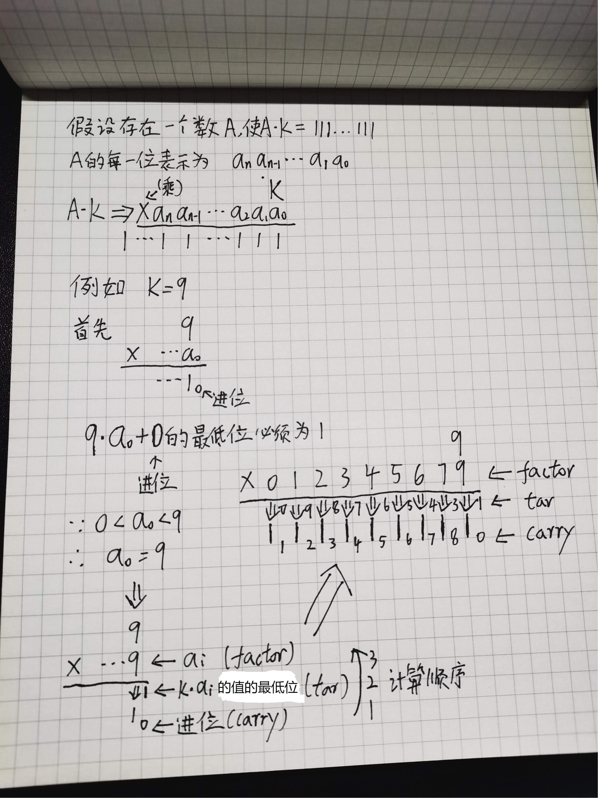
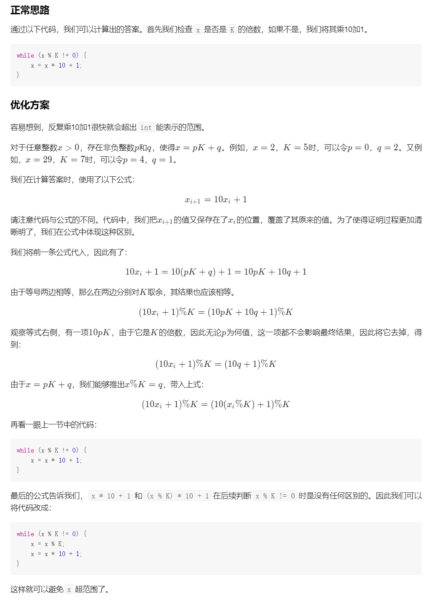
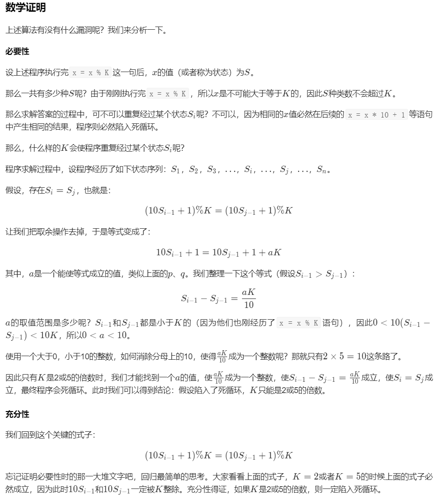

# 1015. 可被 K 整除的最小整数

给定正整数 `K`，你需要找出可以被 K 整除的、仅包含数字 **1** 的最小正整数 N。

返回 `N` 的 **长度** 。如果不存在这样的 `N`，就返回 `-1`。


**示例 1：**

```
输入：1
输出：1
解释：最小的答案是 N = 1，其长度为 1。
```

**示例 2：**

```
输入：2
输出：-1
解释：不存在可被 2 整除的正整数 N 。
```

**示例 3：**

```
输入：3
输出：3
解释：最小的答案是 N = 111，其长度为 3。
```


## 模拟 + 数学分析



```java
class Solution {
    public int smallestRepunitDivByK(int K) {
        int modK = K % 10;
        if (modK != 1 && modK != 3 && modK != 7 && modK != 9) {
            return -1;
        }
        int[] arr = new int[10];
        for (int i = 0; i <= 9; i++) {
            arr[modK*i % 10] = i;   // arr[tar]: K与i相乘, 最低位需要为tar时i的值
        }

        int allCarry = 0, res = 0;
        while (allCarry != 1) {
            allCarry /= 10;
            int carry = allCarry%10;  // 上一轮传过来的 进位
            int tar = (11 - carry) % 10;  // 加上 进位 后, 能使当前位为 1 的值
            // 乘上 K, 能使当前位为 tar 的乘数因子(tar+carry的最低位会等于1)
            int factor = arr[tar];    
            allCarry += factor * K;  // 计算下一轮的 进位
            // arr那里使用modK只是为了节约空间 (因为关注点在最低位的值)
            // 这里 fact 必须乘上 K (因为需要计算 进位)

            res++;
        }

        return res;
    }
}
```


## Math





```java
class Solution {
    public static int smallestRepunitDivByK(int K) {
        if (K%2==0 || K%5==0) return -1;

        int x = 1, res = 1;
        while (x % K != 0) {
            x = x % K;
            x = x * 10 + 1;
            res++;
        }
        return res;
    }
}
```

.