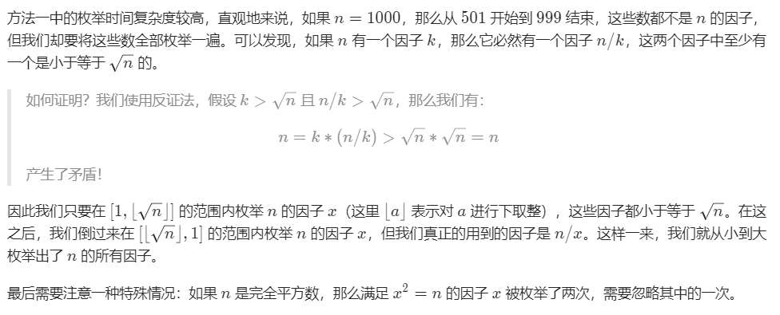

# 1492. The kth Factor of n
Given two positive integers n and k.

A factor of an integer n is defined as an integer i where n % i == 0.

Consider a list of all factors of n sorted in ascending order, return the kth factor in this list or return -1 if n has less than k factors.

**Example 1:**
```
Input: n = 12, k = 3
Output: 3
Explanation: Factors list is [1, 2, 3, 4, 6, 12], the 3rd factor is 3.
```
**Example 2:**
```
Input: n = 4, k = 4
Output: -1
Explanation: Factors list is [1, 2, 4], there is only 3 factors. We should return -1.
```

## 枚举（数学优化）



```java
class Solution {
    public int kthFactor(int n, int k) {
        int cout = 0, fct = 1;
        for ( ; fct * fct <= n; fct++) {
            if (n%fct == 0) if (++cout == k) return fct;
        }
        fct--;
        if (fct * fct == n) fct--;  // 防止完全平方数重复计数

        for ( ; fct > 0; fct--) {
            if (n%fct == 0) if (++cout == k) return n / fct;
        }
        return -1;
    }
}
```

## 暴力枚举

```
略
```