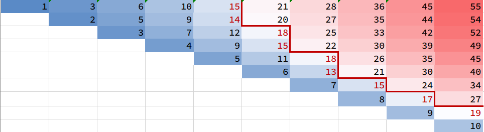

# 1508. Range Sum of Sorted Subarray Sums

Given the array `nums` consisting of `n` positive integers. You computed the sum of all non-empty continous subarrays from the array and then sort them in non-decreasing order, creating a new array of `n * (n + 1) / 2` numbers.

*Return the sum of the numbers from index* `left` *to index* `right` (**indexed from 1**)*, inclusive, in the new array.* Since the answer can be a huge number return it modulo 10^9 + 7.

 

**Example:**

```
Input: nums = [1,2,3,4], n = 4, left = 1, right = 5
Output: 13 
Explanation: All subarray sums are 1, 3, 6, 10, 2, 5, 9, 3, 7, 4. After sorting them in non-decreasing order we have the new array [1, 2, 3, 3, 4, 5, 6, 7, 9, 10]. The sum of the numbers from index le = 1 to ri = 5 is 1 + 2 + 3 + 3 + 4 = 13. 
```

## 二分查找 + 双指针

下面是由 \[1,2,3,4,5,6,7,8,9,10\] 构造出的矩阵的色阶图。假设我们要找所有的 val < 20 的元素数量



```
  PPS[ri]
= P[0] + P[1] + ... + P[ri]

  PPS[ri] - PPS[le]
= P[le+1] + ... + P[ri]
= (a[0]+...+a[le+1]) + ... + (a[0]+...+a[ri])

  PPS[ri] - PPS[le] - P[le]*(ri-le+1)
= (a[le+1]) + (a[le+1]+a[le+2]) + ... + (a[le+1]+a[le+2]+...+a[ri])   
```


```java
class Solution {
    int N, MOD = 1000000007;
    int[] preSum, PPreSum;

    public int rangeSum(int[] nums, int n, int left, int right) {
        N = n;
        preSum = new int[N+1];
        for (int i = 0; i < N; i++) preSum[i+1] = preSum[i] + nums[i];
        PPreSum = new int[N+1];
        for (int i = 1; i <= N; i++) PPreSum[i] = PPreSum[i-1] + preSum[i];

        return (getSum(right) - getSum(left-1)) % MOD;
    }

    public int getSum(int k) {
        int tar = getKth(k);  // tar:第K大的 一维前缀和

        int res = 0, kcnt = 0;
        for (int le = 0, ri = 1; le < N; le++) {
            while (ri <= N && preSum[ri]-preSum[le] < tar) ri++;
            ri--;
            res = (res + PPreSum[ri]-PPreSum[le] - preSum[le]*(ri-le)) % MOD;
            kcnt += ri-le;
        }
        res = (res + tar * (k-kcnt)) % MOD;
        return res;
    }

    public int getKth(int k) {  // 第K大的数（来自 子数组和排序后 的数组）
        int le = 0, ri = preSum[N];
        while (le < ri) {
            int mid = le+ri>>1;
            int count = getCount(mid);  // 小于等于 一维前缀和mid 的数量
            if (count < k) le = mid+1;
            else ri = mid;  // 左边界
        }
        return le;
    }

    public int getCount(int mid) {   // 小于等于 一维前缀和mid 的数量
        int count = 0;
        for (int le = 0, ri = 1; le < N; le++) {
            while (ri <= N && preSum[ri]-preSum[le] <= mid) ri++;
            ri--;
            count += ri-le;
        }
        return count;
    }
}
```