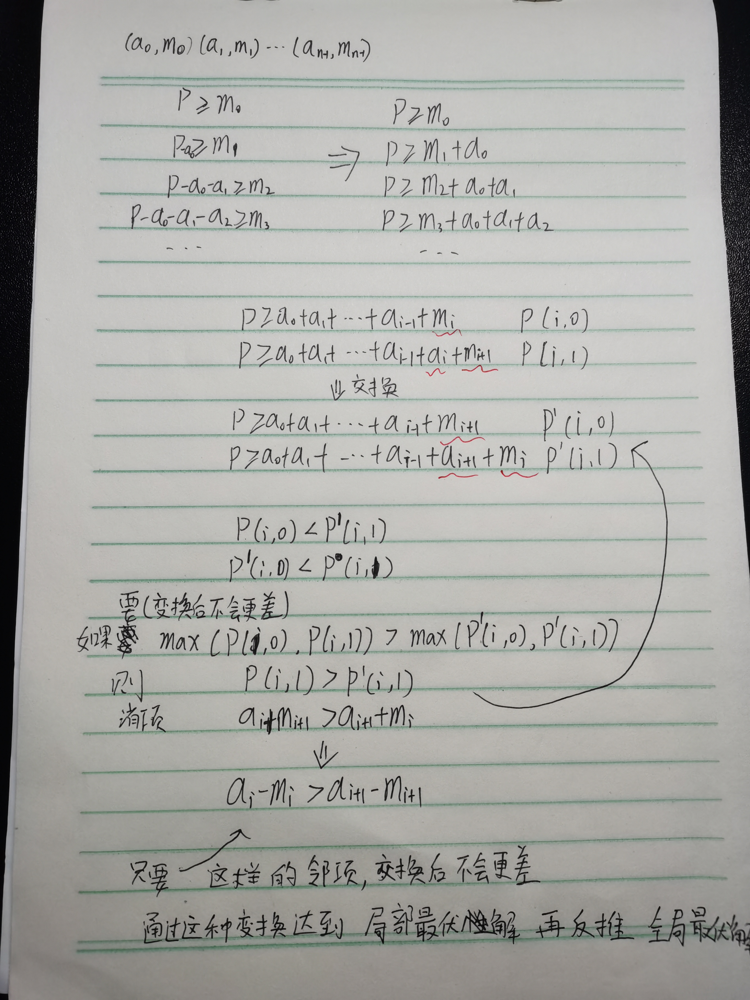

# 1665. 完成所有任务的最少初始能量

给你一个任务数组 `tasks` ，其中 `tasks[i] = [actuali, minimumi]` ：

- `actuali` 是完成第 `i` 个任务 **需要耗费** 的实际能量。
- `minimumi` 是开始第 `i` 个任务前需要达到的最低能量。

比方说，如果任务为 `[10, 12]` 且你当前的能量为 `11` ，那么你不能开始这个任务。如果你当前的能量为 `13` ，你可以完成这个任务，且完成它后剩余能量为 `3` 。

你可以按照 **任意顺序** 完成任务。

请你返回完成所有任务的 **最少** 初始能量。

**示例：**

```
输入：tasks = [[1,2],[2,4],[4,8]]
输出：8
解释：
一开始有 8 能量，我们按照如下顺序完成任务：
    - 完成第 3 个任务，剩余能量为 8 - 4 = 4 。
    - 完成第 2 个任务，剩余能量为 4 - 2 = 2 。
    - 完成第 1 个任务，剩余能量为 2 - 1 = 1 。
注意到尽管我们有能量剩余，但是如果一开始只有 7 能量是不能完成所有任务的，因为我们无法开始第 3 个任务。
```


## 贪心



理解通过 **局部最优解** 到 **全局最优解**

```java
class Solution {
    public int minimumEffort(int[][] tasks) {
        Arrays.sort(tasks, (a, b) -> (b[1]-b[0]) - (a[1]-a[0]));
        int res = 0, sum = 0;
        for (int[] task: tasks) {
            res = Math.max(res, sum + task[1]);
            sum += task[0];
        }
        return res;
    }
}
```

