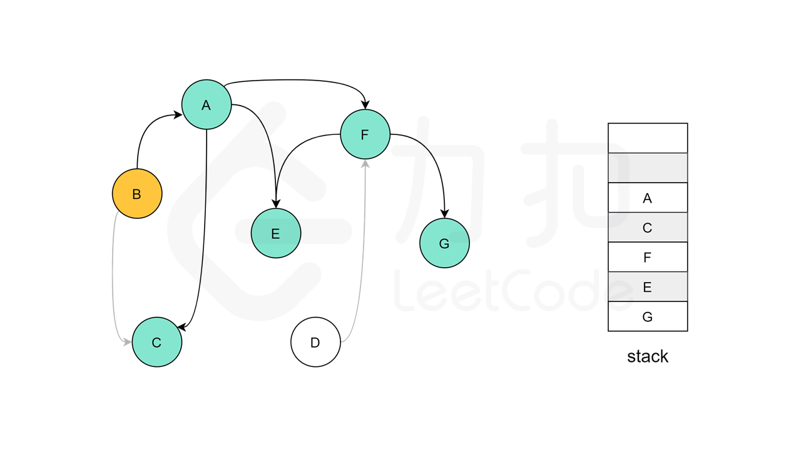

# 210. 课程表 II
现在你总共有 n 门课需要选，记为 0 到 n-1。

在选修某些课程之前需要一些先修课程。 例如，想要学习课程 0 ，你需要先完成课程 1 ，我们用一个匹配来表示他们: [0,1]

给定课程总量以及它们的先决条件，返回你为了学完所有课程所安排的学习顺序。

可能会有多个正确的顺序，你只要返回一种就可以了。如果不可能完成所有课程，返回一个空数组。

**示例:**
输入: 4, [[1,0],[2,0],[3,1],[3,2]]
输出: [0,1,2,3] or [0,2,1,3]
解释: 总共有 4 门课程。要学习课程 3，你应该先完成课程 1 和课程 2。并且课程 1 和课程 2 都应该排在课程 0 之后。
因此，一个正确的课程顺序是 [0,1,2,3] 。另一个正确的排序是 [0,2,1,3] 。

## 拓扑排序（Kahn 算法、类似广度优先遍历的思路）
拓扑排序实际上应用的是贪心算法，贪心算法简而言之：每一步最优，则全局最优。

**算法流程：**
1、在开始排序前，扫描对应的存储空间（使用邻接表），将入度为 0 的结点放入队列。

2、只要队列非空，就从队首取出入度为 0 的结点，将这个结点输出到结果集中，并且将这个结点的所有邻接结点（它指向的结点）的入度减 1，在减 1 以后，如果这个被减 1 的结点的入度为 0， 就继续入队。

3、当队列为空的时候，检查结果集中的顶点个数是否和课程数相等即可。

在代码具体实现的时候，除了保存入度为 0 的队列，我们还需要两个辅助的数据结构：

1、邻接表：通过结点的索引，我们能够得到这个结点的后继结点；

2、入度数组：通过结点的索引，我们能够得到指向这个结点的结点个数。

这个两个数据结构在遍历题目给出的邻边以后就可以很方便地得到。

```java
class Solution {
    public int[] findOrder(int numCourses, int[][] prerequisites) {
        HashSet<Integer>[] adj = new HashSet[numCourses];	// 邻接表
        for (int i = 0; i < numCourses; i++)
            adj[i] = new HashSet<>();

        // [1,0] 0 -> 1
        int[] inDegree = new int[numCourses];				// 入度数组
        for (int[] p : prerequisites) { // 初始化各点的入度
            adj[p[1]].add(p[0]);
            inDegree[p[0]]++;
        }

        Queue<Integer> queue = new LinkedList<>();
        for (int i = 0; i < numCourses; i++) {
            if (inDegree[i] == 0) queue.offer(i);	// 入度为 0 的点 入队列
        }

        int[] res = new int[numCourses];
        int idx = 0;
        while (!queue.isEmpty()) {
            Integer cur = queue.poll();
            res[idx++] = cur;

            Set<Integer> successors = adj[cur];
            for (Integer nextCourse : successors) {	// 遍历邻接表
                inDegree[nextCourse]--;				// 更新入度数组
                // 马上检测该结点的入度是否为 0，如果为 0，马上加入队列
                if (inDegree[nextCourse] == 0)
                    queue.offer(nextCourse);
            }
        }

        // 如果结果集中的数量不等于结点的数量，就不能完成课程任务，这一点是拓扑排序的结论        
        return idx == numCourses ? res : new int[0];
    }
}
```
**复杂度分析：**
- 时间复杂度：O(E + V)。这里 E 表示邻边的条数，V 表示结点的个数。初始化入度为 0 的集合需要遍历整张图，具体做法是检查每个结点和每条边，因此复杂度为 O(E+V)，然后对该集合进行操作，又需要遍历整张图中的每个结点和每条边，复杂度也为 O(E+V)；
- 空间复杂度：O(V)：入度数组、邻接表的长度都是结点的个数 V，即使使用队列，队列最长的时候也不会超过 V，因此空间复杂度是 O(V)。

## DFS
假设我们当前搜索到了节点 u，如果它的所有相邻节点都已经搜索完成，那么这些节点都已经在栈中了，此时我们就可以把 u 入栈。可以发现，如果我们从栈顶往栈底的顺序看，由于 u 处于栈顶的位置，那么 u 出现在所有 u 的相邻节点的前面。因此对于 u 这个节点而言，它是满足拓扑排序的要求的。

这样以来，我们对图进行一遍深度优先搜索。当每个节点进行回溯的时候，我们把该节点放入栈中。最终从栈顶到栈底的序列就是一种拓扑排序。

**算法:**

对于图中的任意一个节点，它在搜索的过程中有三种状态，即：

- 「未搜索」：我们还没有搜索到这个节点；

- 「搜索中」：我们搜索过这个节点，但还没有回溯到该节点，即该节点还没有入栈，还有相邻的节点没有搜索完成）；

- 「已完成」：我们搜索过并且回溯过这个节点，即该节点已经入栈，并且所有该节点的相邻节点都出现在栈的更底部的位置，满足拓扑排序的要求。

通过上述的三种状态，我们就可以给出使用深度优先搜索得到拓扑排序的算法流程，在每一轮的搜索搜索开始时，我们任取一个「未搜索」的节点开始进行深度优先搜索。

我们将当前搜索的节点 u 标记为「搜索中」，遍历该节点的每一个相邻节点 v：

- 如果 v 为「未搜索」，那么我们开始搜索 v，待搜索完成回溯到 u；

- 如果 v 为「搜索中」，那么我们就找到了图中的一个环，因此是不存在拓扑排序的；

- 如果 v 为「已完成」，那么说明 v 已经在栈中了，而 u 还不在栈中，因此 u 无论何时入栈都不会影响到 (u, v) 之前的拓扑关系，以及不用进行任何操作。

当 u 的所有相邻节点都为「已完成」时，我们将 u 放入栈中，并将其标记为「已完成」。

在整个深度优先搜索的过程结束后，如果我们没有找到图中的环，那么栈中存储这所有的 nn 个节点，从栈顶到栈底的顺序即为一种拓扑排序。





```java
public class Solution {
    public int[] findOrder(int numCourses, int[][] prerequisites) {
        int plen = prerequisites.length;
        if (plen == 0) {
            int[] res = new int[numCourses];
            for (int i = 0; i < numCourses; i++)
                res[i] = i;
            return res;
        }

        // 初始化有向图
        HashSet<Integer>[] graph = new HashSet[numCourses];
        for (int i = 0; i < numCourses; i++)
            graph[i] = new HashSet<>();
        for (int[] p : prerequisites)
            graph[p[1]].add(p[0]);   // 有向图的 key 是前驱结点，value 是后继结点的集合   

        Stack<Integer> stack = new Stack<>();   // 使用 Stack 记录递归的顺序
        int[] marked = new int[numCourses];     // 记录节点的访问状态（未访问_0，访问中_1，已访问_2）
        for (int i = 0; i < numCourses; i++) {
            if (dfs(i, graph, marked, stack)) {
                return new int[0];	// 如果图中存在环，表示课程任务不能完成
            }
        }

        assert stack.size() == numCourses;
        int[] res = new int[numCourses];
        for (int i = 0; i < numCourses; i++)
            res[i] = stack.pop();
        return res;
    }

    private boolean dfs(int i, HashSet<Integer>[] graph, int[] marked, Stack<Integer> stack) {
        if (marked[i] == 1) return true;	// 遇到访问中的节点,表示有环
        if (marked[i] == 2) return false;	// 遇到已访问的节点
        marked[i] = 1;          // 状态改为访问中

        // 后继结点的集合
        HashSet<Integer> successorNodes = graph[i];
        for (Integer successor : successorNodes)
            if (dfs(successor, graph, marked, stack))
                return true;

        marked[i] = 2;          // 已访问（且没有环）
        stack.add(i);
        return false;           // false 表示图中不存在环
    }
}
```
**复杂度分析**
- 时间复杂度: O(n + m)，其中 n 为课程数，m 为先修课程的要求数。这其实就是对图进行深度优先搜索的时间复杂度。
- 空间复杂度: O(n + m)。题目中是以列表形式给出的先修课程关系，为了对图进行深度优先搜索，我们需要存储成邻接表的形式，空间复杂度为 O(m)。在深度优先搜索的过程中，我们需要最多 O(n) 的栈空间（递归）进行深度优先搜索，并且还需要若干个 O(n) 的空间存储节点状态、最终答案等。
