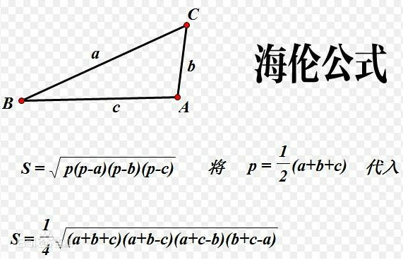

# 812. 最大三角形面积

给定包含多个点的集合，从其中取三个点组成三角形，返回能组成的最大三角形的面积。

**示例:**

```
输入: points = [[0,0],[0,1],[1,0],[0,2],[2,0]]
输出: 2
解释: 
这五个点如下图所示。组成的橙色三角形是最大的，面积为2。
```


## 鞋带公式


```java
class Solution {
    public double largestTriangleArea(int[][] points) {
        int N = points.length;
        double res = 0;
        for (int i = 0; i < N; i++) {
            for (int j = i+1; j < N; j++) {
                for (int k = j+1; k < N; k++) {
                    res = Math.max(res, area(points[i], points[j], points[k]));
                }
            }
        }
        return res;
    }

    public double area(int[] P, int[] Q, int[] R) {
        return 0.5 * Math.abs(P[0]*Q[1] + Q[0]*R[1] + R[0]*P[1]
                             -P[1]*Q[0] - Q[1]*R[0] - R[1]*P[0]);
    }
}
```


## 海伦公式



```java
class Solution {
    public double largestTriangleArea(int[][] points) {
        double a, b, c;
        double p, s = 0.0, res = -1.0;
        
        for (int i = 0; i < points.length-2; i++) {
            for (int j = i+1; j < points.length-1; j++) {
                for (int k = j+1; k < points.length; k++) {
                    a = getLength(points[i], points[j]);
                    b = getLength(points[i], points[k]);
                    c = getLength(points[j], points[k]);
                    
                    p = (a + b + c) / 2;
                    s = Math.sqrt(p * (p - a) * (p - b) * (p - c));
                    res = s > res ? s : res;
                }
            }
        }
        
        return res;
    }
    double getLength(int[] point1, int[] point2) {
        return Math.sqrt((point1[0]-point2[0])*(point1[0]-point2[0])
                       + (point1[1]-point2[1])*(point1[1]-point2[1]));
    }
}
```


## 三角形面积公式

```
S = 1/2 * a * b * sin(C)
```

