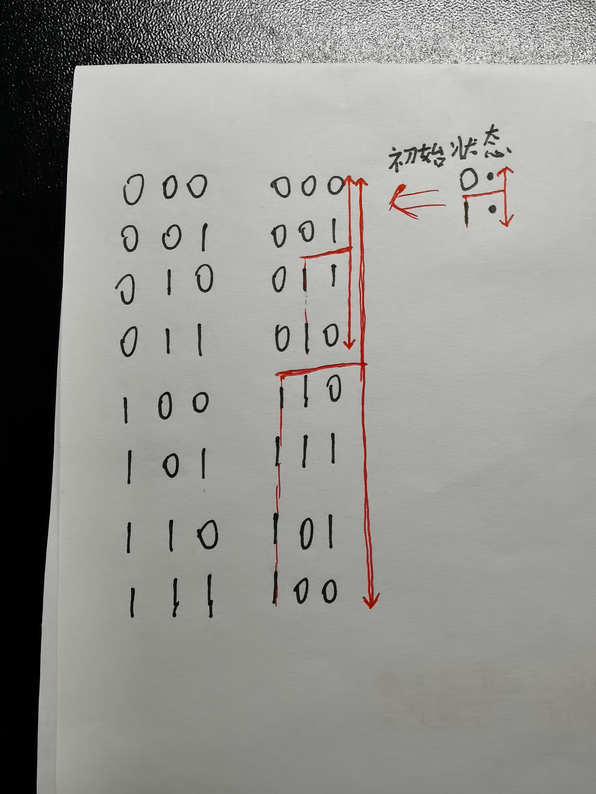
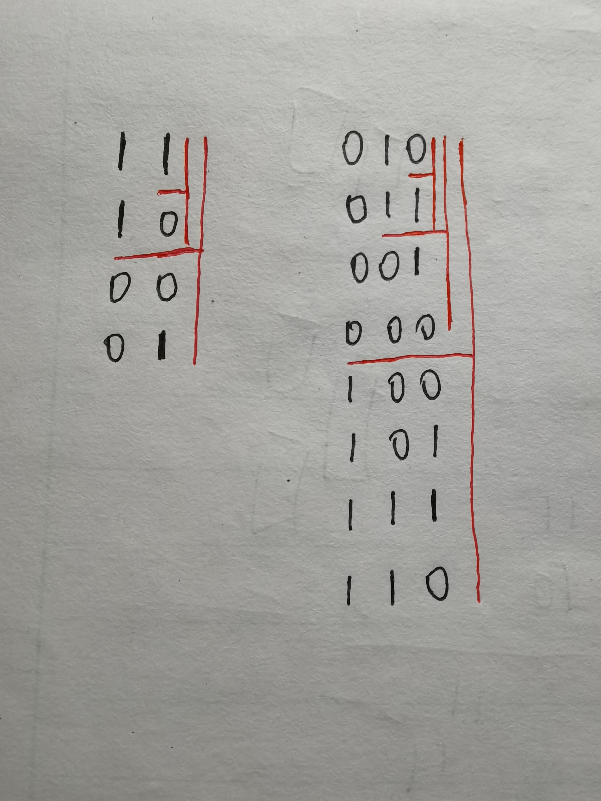

# 89. 格雷编码
格雷编码是一个二进制数字系统，在该系统中，两个连续的数值仅有一个位数的差异。

给定一个代表编码总位数的非负整数 *n*，打印其格雷编码序列。即使有多个不同答案，你也只需要返回其中一种。

格雷编码序列必须以 0 开头。

**示例:**

```
输入: 2
输出: [0,1,3,2]
解释:
00 - 0
01 - 1
11 - 3
10 - 2

对于给定的 n，其格雷编码序列并不唯一。
例如，[0,2,3,1] 也是一个有效的格雷编码序列。

00 - 0
10 - 2
11 - 3
01 - 1
```


## 数学 / “图形游戏”




```java
class Solution {
    public List<Integer> grayCode(int n) {
        List<Integer> res = new ArrayList<>();
        res.add(0);
        int st = 1;
        for (int t = 0; t < n; t++) {
            for (int i = st-1; i >= 0; i--) {
                res.add(st + res.get(i));  // 可以为 +,|,^
            }
            st <<= 1;
        }
        return res;
    }
}
```

```java
class Solution {  // trick
    public List<Integer> grayCode(int n) {
        List<Integer> res = new LinkedList<>();
        for (int st = 0; st < 1<<n; st++) res.add(st ^ st>>1);
        return res;
    }
}
```


# 1238. 循环码排列

给你两个整数 `n` 和 `start`。你的任务是返回任意 `(0,1,2,,...,2^n-1)` 的排列 `p`，并且满足：

- `p[0] = start`
- `p[i]` 和 `p[i+1]` 的二进制表示形式只有一位不同
- `p[0]` 和 `p[2^n -1]` 的二进制表示形式也只有一位不同 

**示例：**

```
输入：n = 2, start = 3
输出：[3,2,0,1]
解释：这个排列的二进制表示是 (11,10,00,01)
     所有的相邻元素都有一位是不同的，另一个有效的排列是 [3,1,0,2]
```

## 数学 / “图形游戏”



```java
class Solution {
    public List<Integer> circularPermutation(int n, int start) {
        List<Integer> res = new ArrayList<>();
        res.add(start);  // !!! start
        int st = 1;
        for (int t = 0; t < n; t++) {
            for (int i = st-1; i >= 0; i--) {
                res.add(st ^ res.get(i));  // 不确定挡板位的状态，需要异或(上一题相可以为“^,|,+“)
            }
            st <<= 1;
        }
        return res;        
    }
}
```

```java
class Solution {
    public List<Integer> circularPermutation(int n, int start) {
        List<Integer> res = new LinkedList<>();
        for (int i = 0; i < 1<<n; i++) {
            res.add(i ^ (i>>1) ^ start);  // !!! ^ start
        }
        return res;
    }
}
```

## 回溯

```java
class Solution {
    boolean[] st;
    List<Integer> res = new ArrayList<>();

    public List<Integer> circularPermutation(int n, int start) {
        st = new boolean[1<<n];
        dfs(start, 0, n);
        return res;
    }

    boolean dfs(int val, int cnt, int n) {
        if (cnt == (1<<n)) return true;
        if (st[val]) return false;
        st[val] = true;
        res.add(val);
        for (int i = 0; i < n; i++) {
            int nex = val ^ (1<<i);
            if (dfs(nex, cnt+1, n)) return true;
        }
        return false;
    }
}
```
