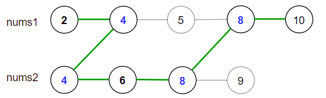

# 1537. 最大得分
你有两个 有序 且数组内元素互不相同的数组 nums1 和 nums2 。

一条 合法路径 定义如下：

选择数组 nums1 或者 nums2 开始遍历（从下标 0 处开始）。
从左到右遍历当前数组。
如果你遇到了 nums1 和 nums2 中都存在的值，那么你可以切换路径到另一个数组对应数字处继续遍历（但在合法路径中重复数字只会被统计一次）。
得分定义为合法路径中不同数字的和。

请你返回所有可能合法路径中的最大得分。

由于答案可能很大，请你将它对 10^9 + 7 取余后返回。

**示例 1：**

输入：nums1 = [2,4,5,8,10], nums2 = [4,6,8,9]
输出：30
解释：合法路径包括：
[2,4,5,8,10], [2,4,5,8,9], [2,4,6,8,9], [2,4,6,8,10],（从 nums1 开始遍历）
[4,6,8,9], [4,5,8,10], [4,5,8,9], [4,6,8,10]  （从 nums2 开始遍历）
最大得分为上图中的绿色路径 [2,4,6,8,10] 。

### DP + 双指针
```java
class Solution {
    public int maxSum(int[] nums1, int[] nums2) {
        int N1 = nums1.length, N2 = nums2.length;
        long res = 0;
        long sum1 = 0, sum2 = 0;
        int p1 = 0, p2 = 0;
        while (p1 < N1 && p2 < N2) {
            if (nums1[p1] == nums2[p2]) {
                res += (Math.max(sum1, sum2) + nums1[p1]);
                p1++; p2++;
                sum1 = 0; sum2 = 0;
            } else if (nums1[p1] < nums2[p2]) {
                sum1 += nums1[p1++];
            } else if (nums1[p1] > nums2[p2]) {
                sum2 += nums2[p2++];
            }
        }

        while (p1 < N1) sum1 += nums1[p1++];
        while (p2 < N2) sum2 += nums2[p2++];
        res += Math.max(sum1, sum2);
        return (int)(res % 1000_000_007);
    }
}
```