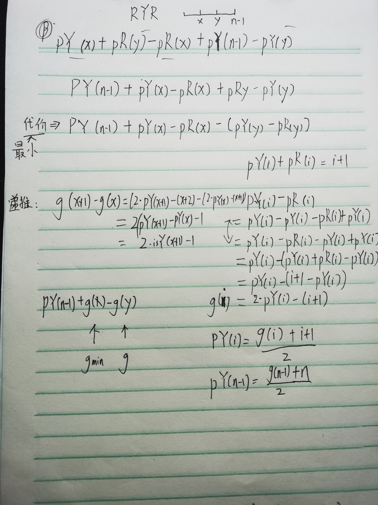
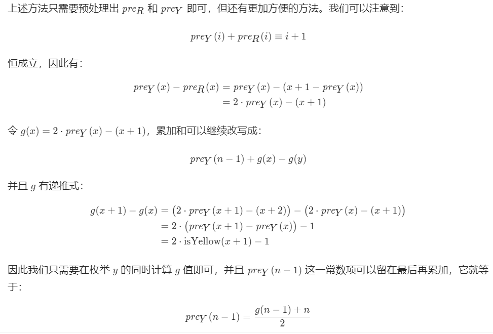

# LCP 19. 秋叶收藏集

小扣出去秋游，途中收集了一些红叶和黄叶，他利用这些叶子初步整理了一份秋叶收藏集 `leaves`， 字符串 `leaves` 仅包含小写字符 `r` 和 `y`， 其中字符 `r` 表示一片红叶，字符 `y` 表示一片黄叶。
出于美观整齐的考虑，小扣想要将收藏集中树叶的排列调整成「红、黄、红」三部分。每部分树叶数量可以不相等，但均需大于等于 1。每次调整操作，小扣可以将一片红叶替换成黄叶或者将一片黄叶替换成红叶。请问小扣最少需要多少次调整操作才能将秋叶收藏集调整完毕。

**示例 1：**

> 输入：`leaves = "rrryyyrryyyrr"`
>
> 输出：`2`
>
> 解释：调整两次，将中间的两片红叶替换成黄叶，得到 "rrryyyyyyyyrr"

**示例 2：**

> 输入：`leaves = "ryr"`
>
> 输出：`0`
>
> 解释：已符合要求，不需要额外操作


## DP

```java
class Solution {
    public int minimumOperations(String leaves) {
        int N = leaves.length();
        int[][] f = new int[N][3];
        f[0][0] = leaves.charAt(0)=='y' ? 1 : 0;
        f[0][1] = Integer.MAX_VALUE;
        f[0][2] = f[1][2] = Integer.MAX_VALUE;
        for (int i = 1; i < N; ++i) {
            int isR = leaves.charAt(i)=='r' ? 1 : 0;
            int isY = leaves.charAt(i)=='y' ? 1 : 0;
            
            f[i][0] = f[i-1][0] + isY;
            f[i][1] = Math.min(f[i-1][0], f[i-1][1]) + isR;
            if (i >= 2) f[i][2] = Math.min(f[i-1][1], f[i-1][2]) + isY;
        }
        return f[N - 1][2];
    }
}
```

```c
#define MIN(x,y) ((x) < (y) ? (x) : (y))

int minimumOperations(char *leaves) {
    // using DP, not recursion
    // we have 3 states (stR, stRY, stRYR), 
    // and use 3 vars to show the min steps to reach these 3 states.
    int stR = leaves[0] == 'y' ? 1 : 0;
    int stRY = stR;
    int stRYR = 3;  // any value that is >2.
    int newS0, newS1, newS2 = stRYR;
    for (int i = 1; leaves[i] != 0; i++) {
        newS0 = stR + (leaves[i] == 'r' ? 0 : 1);
        newS1 = MIN(stR, stRY) + (leaves[i] == 'y' ? 0 : 1);
        if (i > 1) {
            newS2 = MIN(stRY, stRYR) + (leaves[i] == 'r' ? 0 : 1);
        }
        stR = newS0;
        stRY = newS1;
        stRYR = newS2;
    }
    return stRYR;
}
```


## 前缀和





```java
class Solution {
    public int minimumOperations(String leaves) {
        int N = leaves.length();
        int g = leaves.charAt(0) == 'y' ? 1 : -1;
        int gmin = g, res = Integer.MAX_VALUE;
        for (int i = 1; i < N; ++i) {
            int isYellow = leaves.charAt(i) == 'y' ? 1 : 0;
            g += 2 * isYellow - 1;
            if (i != N - 1) {
                res = Math.min(res, gmin - g);
            }
            gmin = Math.min(gmin, g);
        }
        return res + (g + N) / 2;
    }
}
```

