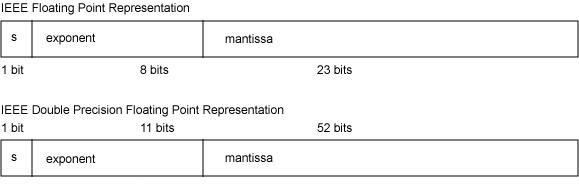

# IEEE754浮点数

## 1.浮点数的存储格式

浮点数（Floating-point Number）是对实数的一种近似表示，由一个有效数字（即尾数）加上幂数来表示，通常是乘以某个基数的整数次幂得到。以这种表示法表示的数值，称为浮点数。表示方法类似于基数为10的科学计数法。利用浮点进行运算，称为浮点计算，这种运算通常伴随着因为无法精确表示而进行的近似或舍入。

计算机对浮点数的表示规范遵循电气和电子工程师协会（IEEE）推出的 IEEE754 标准，浮点数在 C/C++ 中对应 float 和 double 类型。

IEEE754 标准中规定 ：

float 单精度浮点数在机器中， 第 1 位为 符号位，用 8 位表示指数，用 23 位表示尾数，即小数部分。

double 双精度浮点数在机器中，第 1 位为 符号位，用 11 位表示指数，用52 位表示尾数，即小数部分。

IEEE754 浮点数的格式如下图所示：

**其中指数域称为阶码，IEE754 规定浮点数阶码 exp 采用"指数E 的移码 - 1"来表示。**

## 2.移码

移码（又叫增码）是对真值**补码的符号位取反**，一般用作浮点数的阶码，引入的目的是便于浮点数运算时的对阶操作。对于定点整数，计算机一般采用补码的来存储。

比如：
[−3]原=10000011，[3]原=00000011
[−3]反=11111100，[3]反=00000011
[−3]补=11111101，[3]补=01111101
[−3]移=01111101，[3]移=11111101

## 3.浮点数的规格化

若不对浮点数的表示作出明确的规定，同一个浮点数的表示就不是唯一的。例如 (1.75)~10~ 可以表示成1.11×2^0^，0.111×2^1^，0.0111×2^2^等多种形式。当尾数不为0时，尾数域的最高有效位为1，这称为浮点数的规格化。否则，以修改阶码同时左右移动小数点位置的办法，使其成为规格化数的形式。

### 3.1 单精度浮点数真值

IEEE754标准中，一个规格化32位的浮点数x的真值表示为：

**x = (−1)^S^ × (1.M) × 2^E^**

**exp = E + 127 = [E]~移~ - 1**

其中尾数域值是1.M。因为规格化的浮点数的尾数域最左位总是1，故这一位不予存储，而认为隐藏在小数点的左边。

在计算指数E时，对阶码 exp 的计算采用原码的计算方式，因此32位浮点数的8bits的阶码 exp 的取值范围是0到255。其中当 exp 为全0或者全1时，是IEEE754规定的特殊情况，下文会说明。

### 3.2 双精度浮点数真值

64位的浮点数中符号为1位，阶码域为11位，尾数域为52位，指数偏移值是1023。因此规格化的64位浮点数x的真值是：

**x = (−1)^S^ × [1.M]~2~ × 2^E^**

**exp = E + 1023 = E移码 - 1**

## 4.浮点数的具体表示

### 4.1 十进制到机器码

#### 0.5 = [0.1]~2~
1. 符号位S = 0

   [0.1]~2~规格化后为[1.0]~2~

2. 指数E = −1，阶码exp = E + 127  = [126]~10~ = [0111 1110]~2~

3. [0.1]~2~规格化后为[1.0]~2~，单精度浮点数尾数域共23位，尾数域Ｍ 右侧以0补全，得:
   M=[0000 0000 0000 0000 0000 000]~2~

对照单精度浮点数的存储格式，将 **符号位S，阶码exp 和尾数域M** 存放到指定位置，得0.5的机器码：
0.5=[0 0111 1110 0000 0000 0000 0000 0000 000]~2~ = [0x3f000000]~16~

#### 1.5 = [1.1]~2~

1. 符号位S = 0

   [1.1]~2~规格化后为[1.1]~2~

2. 指数E = 0，阶码exp = E + 127 = [127]~10~ = [0111 1111]~2~

3. 规格化后为1.1, 尾数域M = [1000 0000 0000 0000 0000 000]~2~

得1.5的机器码：
1.5 = [0_0111 1111_1000 0000 0000 0000 0000 000]~2~ = [0x3fc00000]~16~

#### -12.5 = [−1100.1]~2~
−12.5，符号位S = 1，规格化后为1.1001, 尾数域Ｍ = [1001 0000 0000 0000 0000 000]~2~，指数E = 3

阶码exp = E + 127 = [130]~10~ = [1000 0010]~2~

即-12.5的机器码：
−12.5 = [1_1000 0010_1001 0000 0000 0000 0000 000]~2~ = [0xc1480000]~16~

#### 22.758
>**步骤①：将整数部分整除以2，取余数部分倒序排列**
>
    22 / 2     11 余 0
    11 / 2     5  余 1
    5  / 2     2  余 1
    2  / 2     1  余 0
    1  / 2     0  余 1
    得到22的二进制是10110

>**步骤②：将小数部分乘以2，取商的整数部分正序排列**
>
     0.758 * 2 = 1.516    取商的整数部分1    1.516 - 1 = 0.516
     0.516 * 2 = 1.032    取商的整数部分1    1.032 - 1 = 0.032
     0.032 * 2 = 0.064    取商的整数部分0
     0.064 * 2 = 0.128    取商的整数部分0
>
     0.128 * 2 = 0.256    取商的整数部分0
     0.256 * 2 = 0.512    取商的整数部分0
     0.512 * 2 = 1.024    取商的整数部分1   1.024 - 1 = 0.024
     0.024 * 2 = 0.048    取商的整数部分0
>
     0.048 * 2 = 0.096    取商的整数部分0
     0.096 * 2 = 0.192    取商的整数部分0
     0.096 * 2 = 0.384    取商的整数部分0
     0.384 * 2 = 0.768    取商的整数部分0
>
     0.768 * 2 = 1.536    取商的整数部分1   1.536 - 1 = 0.536
     0.536 * 2 = 1.072    取商的整数部分1   1.072 - 1 = 0.072
     0.072 * 2 = 0.144    取商的整数部分0
     0.144 * 2 = 0.288    取商的整数部分0
>
     0.288 * 2 = 0.576    取商的整数部分0
     0.576 * 2 = 1.152    取商的整数部分1    1.152 - 1 = 0.152
     0.152 * 2 = 0.304    取商的整数部分0

>尾数可以取23位，但因小数点后第一位"1"不显式地表示出来，这样可用23位来表示24位尾数，因前面整数已经占6位，则小数部分只能取18位，即1100 0010 0000 1100 010

>故22.758转换为规格化二进制为：10110.1100 0010 0000 1100 010

22.758 = [10110.1100 0010 0000 1100 01]~2~，符号位S 为0，

规格化后尾数为1.0110 1100 0010 0000 1100 01， 尾数域M = [0110 1100 0010 0000 1100 010]~2~，

指数E 为4

阶码exp  = E + 127 = [131]~10~ = [1000 0011]~2~

即22.758的机器码：
22.758 = [0_1000 0011_0110 1100 0010 0000 1100 010]~2~ = [0xc1b61062]~16~

### 4.2 机器码到十进制

若浮点数x 的IEEE754标准存储格式为0x41360000，那么其浮点数的十进制数值的推演过程如下：

0x41360000=[0 1000 0010 0110 1100 0000 0000 0000 000] 

#### 1.符号位

[**0** 1000 0010 0110 1100 0000 0000 0000 000] 

**符号位 S = 0**

#### 2.指数

[0 **1000 0010** 0110 1100 0000 0000 0000 000] 

**指数 E = 阶码exp - 127 = [1000 0010] - 127 = 130 - 127 = 3**

>注意，根据阶码求指数时，可以像上面直接通过 "阶码-127"求得指数e，也可以将 阶码exp + 1= 移码
，再通过移码求其真值便是指数e。比如 上面 阶码[10000010] + 1 = [10000011]~移~ = [00000011]~补~ = 3

#### 3. 尾数域
[0 1000 0010 **0110 1100 0000 0000 0000 000**] 

包括尾数域最左边的隐藏位1，那么**尾数1.M=1.011 0110 0000 0000 0000 0000=[1.011011]~2~**。

#### 4.求值

于是有：
**x = (−1)^S^ × [1.M]~2~ × 2^E^ = (-1)^0^ × [1.011011]~2~ × 2^3^ = [1011.011]~2~ = [11.375]~10~**

## 5.浮点数的几种特殊情况

### 0 的表示

对于阶码为 0 或 255 的情况，IEEE754 标准有特别的规定：
如果 阶码exp = 0 并且 尾数 M = 0，则这个数的真值为 ±0（正负和数符位有关）

+0 的机器码为：0 0000 0000 000 0000 0000 0000 0000 0000。

-0 的机器码为： 1 0000 0000 000 0000 0000 0000 0000 0000。

> 需要注意一点，浮点数**不能精确**表示 0，而是以很小的数来**近似**表示 0，因为浮点数的真值等于（以32bits单精度浮点数为例）：
>
> **x = (−1)^S^ × (1.M) × 2^E^**
>
> **E = exp − 127**
>
> 那么 +0 的机器码对应的真值为1.0×2^−127^。同理，-0 机器码真值为−1.0×2^−127^。

### +∞ 和 −∞ 的表示

如果 阶码exp = 255 并且 尾数M 全是0，则这个数的真值为 ±∞（正负和符号位有关）

+∞的机器码为：0 11111111 000 0000 0000 0000 0000 0000

−∞的机器吗为：1 11111111 000 0000 0000 0000 0000 0000。

### NaN（Not a Number）

如果 阶码exp = 255 并且 尾数M 不全是0，则这不是一个数（NaN）。

## 6.浮点数的精度和数值范围

### 6.1 浮点数的数值范围

根据上面的探讨，浮点数可以表示-∞到+∞，这只是一种特殊情况，显然不是我们想要的数值范围。

以 32 位单精度浮点数为例，阶码 exp 由 8 位表示，取值范围为 0-255，**去除 0 和 255 这两种特殊情况**，那么指数E 的取值范围就是 1-127=-126 到 254-127=127。

**（1）最大正数**
因此单精度浮点数最大正数值的符号位S=0，阶码exp = 254，指数E = 254-127 = 127，尾数M=111 1111 1111 1111 1111 1111，

其机器码为：0 1111 1110 111 1111 1111 1111 1111 1111。

那么最大正数值:

PosMax = (−1)^S^ × 1.M × 2^E^ = 1 × (1.1111 1111 1111 1111 1111 111)~2~ × 2^127^ ≈ 3.402823 e+38

这是一个很大的数。

**（2）最小正数**
最小正数符号位S = 0，阶码exp = 1，指数E = 1 - 127 = -126，尾数M = 0，

其机器码为0 0000 0001 000 0000 0000 0000 0000 0000。

那么最小正数为：
PosMin = (−1)^S^ × 1.M × 2^E^ = 1 × (1.0)~2~ × 2^−126^ ≈ 1.175494e−38

这是一个相当小的数。几乎可以近似等于0。当阶码exp=0，指数为-127时，IEEE754就是这么规定1.0×2−127

1.0×2−127近似为0的，事实上，它并不等于0。

**（3）最大负数**
最大负数符号位S = 1，阶码exp = 1，指数E = 1 - 127 = -126，尾数M=0，机器码与最小正数的符号位相反，其他均相同，

其机器码为：1 0000 0001 000 0000 0000 0000 0000 0000。

最大负数等于：
NegMax = (−1)^S^ × 1.M × 2^E^ = (-1) × (1.0)~2~ × 2^−126^ ≈ −1.175494e−38

**（4）最小负数**
符号位S = 0，阶码exp = 254，指数E = 254-127 = 127，尾数M = 111 1111 1111 1111 1111 1111，

其机器码为：1 1111 1110 111 1111 1111 1111 1111 1111。

计算得：
NegMin=(−1)^S^ × 1.M × 2^E^ = 1 × (1.11111111111111111111111)~2~ × 2^127^ = −3.402823e+38

### 6.2 浮点数的精度

先给精度下一个定义。浮点数的精度是指浮点数的小数位所能表达的位数。

阶码的二进制位数决定浮点数的表示范围，尾数的二进制位数表示浮点数的精度。以 32 位浮点数为例，尾数域有 23 位。那么浮点数以二进制表示的话精度是 23 位，23 位所能表示的最大数是 2^23−1^ = 8388607，所以十进制的尾数部分最大数值是 8388607，也就是说尾数数值超过这个值，float 将无法精确表示，**所以 float 最多能表示小数点后 7 位，但绝对能保证的为 6 位，即 float 的十进制的精度为 6~7 位。**

64 位双精度浮点数的尾数域 52 位，因2^52−1^ = 4,503,599,627,370,495，**所以双精度浮点数的十进制的精度最高为 16 位，绝对保证的为 15 位，所以 double 的十进制的精度为 15~16 位。**

