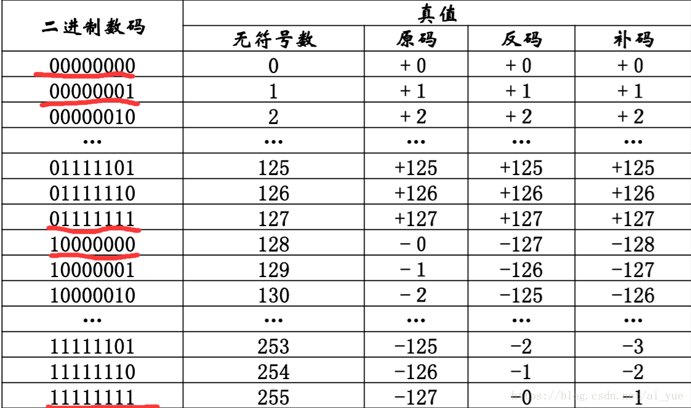

# 原码， 反码， 补码的基础概念和计算方法。

## 原码

**原码就是符号位加上真值的绝对值， 即用第一位表示符号， 其余位表示值。**

[+1]原 = 0000 0001

[-1]原 = 1000 0001

第一位是符号位。 因为第一位是符号位， 所以8位二进制数的取值范围就是：

[1111 1111 ， 0111 1111]

即

[-127 ， 127]

原码是人脑最容易理解和计算的表示方式。

## 反码

**正数的 反码 是其本身，**

**负数的 反码 是在其 原码 的基础上，符号位不变，其余各个位取反。**

[+1] = [00000001]原 = [00000001]反

[-1] = [10000001]原 = [11111110]反

可见如果一个反码表示的是负数， 人脑无法直观的看出来它的数值。 通常要将其转换成原码再计算。

## 补码

**正数的 补码 就是其本身，**

**负数的 补码 是在其 原码 的基础上，符号位不变，其余各位取反，最后+1。(即在反码的基础上+1)**

[+1] = [00000001]原 = [00000001]反 = [00000001]补

[-1] = [10000001]原 = [11111110]反 = [11111111]补

对于负数， 补码表示方式也是人脑无法直观看出其数值的。 通常也需要转换成原码在计算其数值。

## 移码

**不管正负数，只要将其补码的符号位取反即可。**

例如：X = [10101011]~2~ ， [X]原= 10101011 ，[X]反=11010100，[X]补=11010101，[X]移=01010101

## 零的表示
+0的原码是0000 0000， -0的原码是1000 0000

+0的反码是0000 0000， -0的反码是1111 1111

+0的补码是0000 0000， -0的补码是0000 0000 (1000 0000 -> 1111 1111 -> 1 0000 0000)

+0的移码是1000 0000， -0的移码是1000 0000

## 表示范围

8位二进制原码的表示范围：-127～+127

8位二进制反码的表示范围：-127～+127

8位二进制补码的表示范围：-128～+127

8位二进制移码的表示范围：-128～+127

## 为何要使用原码， 反码和补码

计算机可以有三种编码方式表示一个数。 对于正数因为三种编码方式的结果都相同：
[+1] = [00000001]原 = [00000001]反 = [00000001]补

所以不需要过多解释。 但是对于负数：
[-1]
[10000001]原
[11111110]反
[11111111]补

可见原码， 反码和补码是完全不同的。 既然原码才是被人脑直接识别并用于计算表示方式， 为何还会有反码和补码呢?
首先， 因为人脑可以知道第一位是符号位， 在计算的时候我们会根据符号位， 选择对真值区域的加减。 (真值的概念在本文最开头)。 但是对于计算机， 加减乘数已经是最基础的运算， 要设计的尽量简单。 计算机辨别"符号位"显然会让计算机的基础电路设计变得十分复杂! 于是人们想出了将符号位也参与运算的方法。 我们知道， 根据运算法则减去一个正数等于加上一个负数， 即： 1-1 = 1 + (-1) = 0 ， 所以机器可以只有加法而没有减法， 这样计算机运算的设计就更简单了。
于是人们开始探索 将符号位参与运算， 并且只保留加法的方法。 首先来看原码：
计算十进制的表达式： 1-1=0
1 - 1 = 1 + (-1) =
[00000001]原 + [10000001]原 =
[10000010]原 = -2

如果用原码表示， 让符号位也参与计算， 显然对于减法来说， 结果是不正确的。这也就是为何计算机内部不使用原码表示一个数。

**为了解决原码做减法的问题， 出现了反码：**
计算十进制的表达式： 1 - 1 = 0
1 - 1 = 1 + (-1) =
[0000 0001]原 + [1000 0001]原 =
[0000 0001]反 + [1111 1110]反 =
[1111 1111]反 = [1000 0000]原 = -0

发现用反码计算减法， 结果的真值部分是正确的。 而唯一的问题其实就出现在"0"这个特殊的数值上。 虽然人们理解上+0和-0是一样的， 但是0带符号是没有任何意义的。 而且会有 [0000 0000]原 和 [1000 0000]原 两个编码表示0。

**于是补码的出现， 解决了0的符号以及两个编码的问题：**
1-1 = 1 + (-1) =
[0000 0001]原 + [1000 0001]原 =
[0000 0001]补 + [1111 1111]补 =
[0000 0000]补 = [0000 0000]原 = 0

这样0用[0000 0000]表示， 而以前出现问题的-0则不存在了。而且可以用[1000 0000]表示-128：
(-1) + (-127) =
[1000 0001]原 + [1111 1111]原 =
[1111 1111]补 + [1000 0001]补 = [1000 0000]补 = -128

-1-127的结果应该是-128， 在用补码运算的结果中， [1000 0000]补 就是-128。 但是注意因为实际上是使用以前的-0的补码来表示-128， 所以-128并没有原码和反码表示。(对-128的补码表示[1000 0000]补算出来的原码是[0000 0000]原， 这是不正确的)

==使用补码， 不仅仅修复了0的符号以及存在两个编码的问题， 而且还能够多表示一个最低数。== 这就是为什么8位二进制， 使用原码或反码表示的范围为[-127， +127]，而使用补码表示的范围为[-128， 127]。因为机器使用补码， 所以对于编程中常用到的32位int类型， 可以表示范围是： [ -2^31^， 2^31^-1 ] 因为第一位表示的是符号位。而使用补码表示时又可以多保存一个最小值。