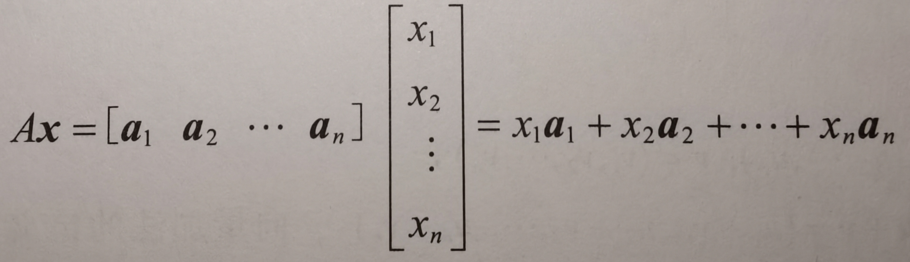

# ==定义==
## 阶梯形（行阶梯形）
**一个矩阵称为阶梯形（或行阶梯形），若它有以下三个性质：**

1.每一非零行都在每一零行之上。

2.某一行的先导元素（改行中最左边的非零元素）所在的列位于妻前一行先导元素的右边。

3.某一先导元素所在列下方元素都是零。

**若一个阶梯形矩阵还满足以下性质，则称它为简化阶梯形（或简化行阶梯形）：**

1.每一非零行的先导元素是 1。

2.每一先导元素 1 是该元素所在列的唯一非零元素。

## Span{v~1~, v~2~, ... , v~p~}
若 v~1~, v~2~, ... , v~p~ 是 **R^n^** 中的向量，则 v~1~, v~2~, ... , v~p~ 的所有线性组合所成的集合用记号 **Span{v~1~, v~2~, ... , v~p~}** 表示， 称为由 v~1~, v~2~, ... , v~p~ 所生成（或张成）的 **R^n^** 的子集。也就是说，**Span{v~1~, v~2~, ... , v~p~}** 是所有形如：

>c~1~v~1~ + c~2~v~2~ + ... + c~p~v~p~

的向量的集合， 其中 c~1~, c~2~, ... , c~p~ 是标量。

## *Ax*
若 *A* 是 *m × n* 矩阵， 它的各列为 a~1~, a~2~, ... , a~n~， 若 *x* 是 **R^n^** 中的向量， 则 *A* 与 *x* 的积（记为*Ax*）就是 *A* 的各列以 *x* 中对应元素为权的线性组合， 即：

## 线性无关和线性相关
若向量方程 *x~1~v~1~ + x~2~v~2~ + ... + x~p~v~p~* = 0 **仅有平方解**， 则 **R^n^** 中一组向量 {v~1~, ... , v~p~} 称为 **线性无关**
若向量方程 *x~1~v~1~ + x~2~v~2~ + ... + x~p~v~p~* = 0 **有非平方解**， 则 **R^n^** 中一组向量 {v~1~, ... , v~p~} 称为 **线性有关**

## 线性变换
变换（或映射） *T* 称为线性的，若：
1. 对 *T* 的定义域中一切向量 u, v, *T*(u+v) = *T*(u) + *T*(v)
2. 对 *T* 的定义域中一切 u 和数 c， *T*(cu) = c*T*(u)
3. *T*(0) = 0
4. 对 *T* 的定义域中一切向量 u, v 以及数 c 和 d, *T*(cu+dv) = c*T*(u) + d*T*(v)

***
# ==定理==

##### 定理 1
每个矩阵等价于唯一的简化阶梯形矩阵。

##### 定理 2
**线性方程组相容的充要条件是増广矩阵的最右列不是主元列。**

**若线性方程组相容，则它的解集可能有两种情况：**

1.当没有自由变量是，有唯一解。

2.若至少有一个自由变量，则有无穷多解。 

##### 定理 3
若 *A* 是 *m × n* 矩阵， 它的各列为 a~1~, a~2~, ... , a~n~，而 *b* 属于 **R^m^**，则：

>矩阵方程： *Ax = b*
向量方程： x~1~a~1~ + x~2~a~2~ + ... + x~n~a~n~ = *b*
増广矩阵： [a~1~ a~2~ ... a~n~ *b*]

有相同的解集。

##### 定理 4
当 A 是 m × n 矩阵， 则下列命题是逻辑上等价的，也就是说，对某个A， 它们都成立或者都不成立：
- 对 **R^m^** 中的每个 *b*，方程 *Ax = b* 都有解。
- **R^m^** 中的每个 *b* 都是 *A* 的列的一个线性组合。（则称 *A* 的各列生成**R^m^**）
- *A* 在每一行都有一个主元位置。（系数矩阵）

##### 定理 5
若 *A* 是 *m × n* 矩阵，对 **R^n^** 中的一切向量 u, v 以及标量 c：

1. *A*(u + v) = *A*u + *A*v
2. *A*(cu) = c(*A*u)

##### 定理 6
设方程 *Ax = b* 对某个 *b* 是相容的， *p* 为一个特解， 则 *Ax = b* 的解集是所有形如 *w = p + v~h~*  的向量的集， 其中vh 是齐次方程 *Ax* = 0 的任意一个解。

##### 定理 7
两个或更多个向量的集合 *S* = {*v~1~, ... , v~p~*} 线性相关， 当且仅当 *S* 中至少有一个向量是其他向量的线性组合。事实上，若 *S* 线性相关， 且 v~1~ != 0， 则某个 v~j~(j > 1) 是它前面向量 *v~1~, ... , v~j-1~* 的线性组合。

##### 定理 8
若一个向量组的向量个数超过每个向量的元素个数，那么这个向量组线性相关。也就是说，**R^n^** 中任意向量组{v~1~, ... , v~p~} 当 *p* > n 时线性相关。

##### 定理 9
若 **R^n^** 中向量组 *S* = {v~1~, ... , v~p~} 包含零向量， 则它线性相关。

##### 定理 10
设 *T*： **R^n^** -> **R^m^** 为线性变换， 则存在唯一的矩阵 *A*， 使得对**R^n^**

***
# ==术语表==

##### 初等行变换
1.（倍加变换）把某一行换成他本身与另一行的倍数的和。（把某一行的倍数加到另一行上。）
2.（对换变换）把两行对换。
3.（倍乘变换）把某一行的所以元素乘以同一个非零数。

##### 行等价
若其中一个矩阵可以经过一系列初等航变换变成另一个矩阵，则称两个矩阵**行等价**。
若两个矩阵的增光矩阵是**行等价**的，则它们具有相同的解集。

##### 行化简算法
- 由最左的非零列开始。这是一个主元列，主元位置在该列顶端。
- 在主元列中选取一个非零元素作为主元。如果有必要，对换两行使这个元素到主元位置上。
- 用倍加变换将主元下面的元素变成 0。
- 暂时不管包含主元位置的及它上面的行， 对剩下的矩阵进行上述三个步骤直到没有非零行需要处理为止。
- 从最右边的主元开始，把每个主元上方的个元素变成 0，并且用倍乘变换把主元变成 1。

##### R^n^ 中向量的代数性质
对 **R^n^** 中的一切向量 u, v, w 以及标量 c 和 d。

1. u + v = v + u
2. (u + v) + w = u + (v + w)
3. u + 0 = 0 + u = u
4. u + (-u) = -u + u = 0
5. c(u + v) = cu + cv
6. (c + d)u = cu + du
7. c(du) = (cd)u
8. 1u = u

##### 解的存在性
方程 *Ax = b* 有解当且仅当 *b* 是 *A* 的各列的线性组合。

##### 齐次线性方程组
若方程组可以写成 *Ax* = 0 的形式，则称线性方程组为**齐次的**。
*x* = 0称为**平凡解**，满足 *Ax* = 0 的非零向量 *x* 称为**非平凡解**。

> 齐次方程 *Ax* = 0 有非平凡解当且仅当方程至少有一个自由变量。