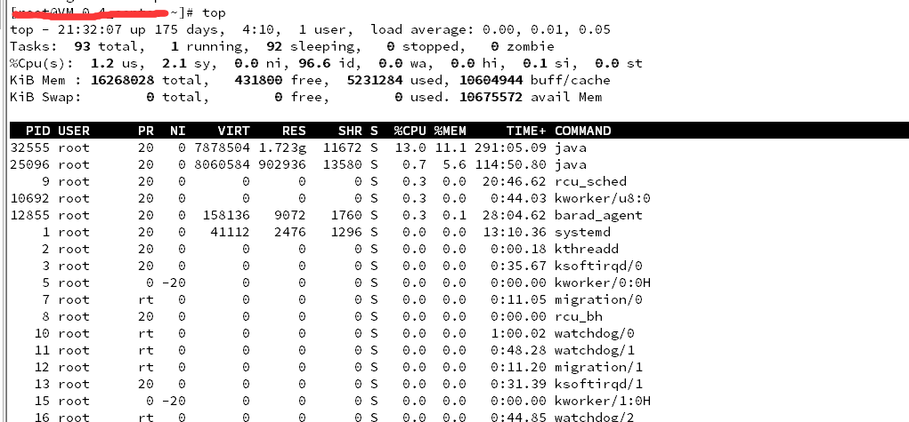

#Linux 查看内存使用情况

##1.top  : 用于实时显示 process 的动态

- PID：进程的ID
- USER：进程所有
- PR：进程的优先级别，越小越优先被执
- VIRT：进程占用的虚拟内
- RES：进程占用的物理内
- SHR：进程使用的共享内
- S：进程的状态,S表示休眠，R表示正在运行，Z表示僵死状态，N表示该进程优先值为负
- %CPU：进程占用CPU的使用
- %MEM：进程使用的物理内存和总内存的百分
- TIME+：该进程启动后占用的总的CPU时间，即占用CPU使用时间的累加值
- COMMAND：进程启动命令名称

##2.free：查看系统内存使用情况

- total:总计物理内存的大小
- used:已使用多大
- free:可用有多少
- shared:多个进程共享的内存总额
- buff/cached:磁盘缓存的大小

##3.cat /proc/meminfo: 查看RAM使用情况最简单的方法是通过/proc/meminfo
这个动态更新的虚拟文件实际上是许多其他内存相关工具(如：free / ps / top)等的组合显示。

/proc/meminfo列出了所有你想了解的内存的使用情况。

进程的内存使用信息也可以通过/proc/<pid>/statm 和 /proc/<pid>/status 来查看。
