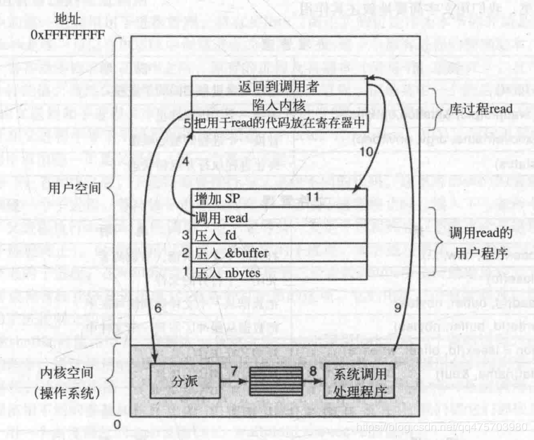

**1、操作系统的两大主要作用是什么？**

- 1.为应用程序提供一个资源集的清晰抽象（另一种说法：操作系统给用户提供了一个可扩展的机器。个人理解是通过对底层的抽象，对外提供各种接口支持扩展）
- 2.管理各种软硬件资源

**2、在1.4节中描述了9中不同类型的操作系统，列举每种操作系统的应用（每种系统一种应用）**
- 1.大型操作系统（Mainframe operating system）：大型保险公司的索赔流程处理系统
- 2.服务器操作系统（Server operating system）：比如苹果手机 的Siri所提供的语音到文本的转换服务
- 3.多处理器操作系统（Multiprocessor operating system）：视频编辑与渲染
- 4.个人计算机操作系统（Personal computer operating system）：文字处理应用
- 5.掌上计算机操作系统（Handheld computer operating system）：上下文感知推荐系统
- 6.嵌入式操作系统（Embedded operating system）：为DVD录像机设计的录像程序。
- 7.传感器节点操作系统（Sensor-node operating system）：野外温度监测
- 8.实时操作系统（Real-time operating system）：航空管制系统
- 9.智能卡操作系统（Smart-card operating system）：电子支付

**3.分时系统和多道程序系统的区别是什么？**

答：在分时系统中，多个用户可以使用他们自己的终端同时访问和执行计算系统上的计算。 多道程序设计系统允许用户 同时 运行多个程序。 ==所有分时系统都是多道程序设计系统，但并非所有多道程序设计系统都是分时系统，因为多道程序设计系统可以在只有一个用户的PC上运行。==

**4.为了使用高速缓存，主存被划分为若干cache行，同城每行长32或64 Bytes。每次缓存一整个cache line，每次缓存一整行而不是一个Byte或一个Word，这样的优点是什么？**

答：经验证据表明，存储器访问表现出引用局部原则，即如果读取某一个位置，则接下来访问这个位置的概率非常高，尤其是紧随其后的内存位置。 因此，通过缓存整个缓存行，接下来缓存命中的概率会增加。 此外，现代的硬件可以将32或64字节块整个传输到高速缓存行，比单个字节读取快得多。

**5.在早期计算机中，每个字节的读写直接由CPU处理（即没有DMA）。这对多道程序而言有什么影响？**

答：DMA（Direc Memory Access）:直接存储器访问。
多道程序设计的主要原因是在某个程序等待I/O完成时，可以让CPU做一些其他操作。如果没有DMA，则CPU完全占用I/O，多道程序设计将没有任何收益增加（至少在CPU利用率方面）。 不管一个程序有多少I/O ，CPU都将100％处于忙碌（*被占用*）。当然这是假设主要的延迟是等待数据复制的时间。如果由于其他原因（例如，到达串行线路）I/O很慢，CPU可以执行其他工作。

**6.与访问I/O设备相关的指令通常是特权指令，也就是说，他们能在内核态执行而在用户态则不行，说明为什么这些指令是特权指令。**

答：典型的例子，比如对于I/O设备（例如，打印机）的访问，通常对不同用户限制也不同。某些用户可以允许打印任意数量的页面，某些用户可能根本不允许打印，而一些用户可能仅限于打印一定数量的页面。 这些限制由系统管理员根据某些策略设置。 需要强制执行此类策略，以便用户级别的程序不会干扰它们。

**7.系列计算机的思想在20世界60年代由IBM引入System/360大型机。现在这种思想是消亡还是存活？**

答：依然活着。 例如，英特尔使Core i3，i5和i7 CPU具有各种不同的属性，包括速度和功耗。 所有这些计算机都在架构上兼容。 只是它们的价格和性能不同。

**8.缓慢采用GUI的一个原因是支持他的硬件的成本高昂，为了支持25行80列的单色文本屏幕，需要多少视频RAM？对于1024x768像素24位色彩图需要多少RAM？在1980年每KB 5美元，这些RAM成本是多少？现在成本多少？**

	25x80 × 1Byte = 2000字节
	1024x768 × 3Byte = 2359296字节（一字节8位，24位就是三个字节）

**9.在建立一个操作系统时有几个设计目的，例如资源利用、及时性、健壮性等，请列举两个可能相互矛盾的设计目的。**

答：公平性和实时性。 公平性要求每个进程都以公平的方式分配其资源，没有任何进程获得超过公平份额。 另一方面，实时性需要根据不同进程必须完成执行的时间来分配资源。 实时进程可能会获得不成比例的资源份额。 他们就是互相矛盾的。

**10.内核态和用户态有哪些区别？解释在设计操作系统时存在两种不同的模式有什么帮助。**

答：大多数现代CPU提供两种执行模式：内核态和用户态。 CPU可以执行其指令集中的每条指令，并在内核态下执行时使用硬件的各种功能。 但是用户态只能执行部分指令，执行时仅使用部分功能。 拥有两种模式允许设计人员以用户态运行用户程序，从而拒绝他们访问关键指令。

**11.一个255GB大小的磁盘有65536个柱面，每个柱面255个扇区。每个扇区512字节。这个磁盘有多少盘片和磁头？假设平均寻道时间为11ms,平均旋转延迟为7ms,读取速度100MB/s,计算从一个扇区读取400kb需要的平均时间。**

    存储容量 ＝ 柱面数 × 每柱面字节数
    柱面字节数 = 磁头数 × 每磁道字节数
    磁道字节数 = 每道扇区数 × 每扇区字节数

    存储容量 ＝柱面数 ×　磁头数 × 每道扇区数 × 每扇区字节数

    磁头数= (255 × 2^30) /（65536 × 255 × 512）= 32
    盘片数量= 32/2 = 16
    读取操作完成的时间是寻道时间+旋转延迟+传输时间。 寻道时间为11 ms，旋转延迟为7 ms，传输时间为4 ms，因此平均传输时间为22 ms。

**12、下面哪一条指令只能在内核态使用？
    a 禁止所有的中断
    b 读日期-时间时钟
    c 设置日期-时间时钟
    d 改变存储器映像**

答： a、c、d

**13、考虑一个有两个CPU的系统，且每一个CPU有两个线程（超线程）。假设有三个程序P0、P1\P2，分别以运行时间5ms, 10ms,20ms开始，运行这些程序需要多少时间？假设这三个程序都是100%限于CPU，在运行时无阻赛，并且一旦设定就不改变CPU。**

答： 完成这些程序的执行可能需要20,25或30毫秒，具体取决于操作系统如何安排它们。 如果P0和P1在同一个CPU上进行调度，而P2在另一个CPU上进行调度，则需要20毫秒。 如果P0和P2安排在同一个CPU上并且P1安排在另一个CPU上，则需要25毫秒。 如果P1和P2安排在同一个CPU上并且P0安排在另一个CPU上，则需要30毫秒。 如果所有三个都在同一个CPU上，则需要35毫秒。

**14、一台计算机有一个四级流水线，每一级都花费相同的时间执行其工作，即1ns, 这台机器每秒可执行多少条指令？**

答：每一纳秒的指令都从管道中出现。 这意味着机器每秒执行10亿条指令。 根本没关系管道有多少个阶段。 每级1 nsec的10级流水线每秒也会执行10亿条指令。==重要的是完成的指令弹出管道末端的频率。==

**15.假设一个计算机系统有高速缓存、内存以及磁盘，操作系统用呼你内存。读取缓存中的一个词需要1ns, 内存需要10ns, 磁盘需要10ms。如果缓存命中率是95%， 内存的是99%（缓存失效时），读取一个词的平均时间是多少？**

答：平均访问时间 = 0.95×1 nsec（词在缓存中）+ 0.05×0.99×10 nsec（词在RAM中，但不在缓存中）+ 0.05×0.01×10,000,000 nsec（仅限磁盘上的词）
= 5001.445纳秒(5.001445μsec)

**16.在用户程序进行一个系统调用，以读写磁盘文件时，该程序提供指示说明了所需要的文件，一个指向数据缓冲区的指针以及计数。然后，控制权转给操作系统，它调用相关的驱动程序。假设驱动程序启动磁盘并且直到中断发生才终止。在从磁盘读的情况下，很明显，调用者会被阻塞（因为文件中没有数据）。在向磁盘写时会发生什么情况？需要把调用者阻塞一直等到磁盘传送完成为止吗？**

答：也许。如果调用者取回控制，并且在最终发生写操作时立即重写数据，将会写入错误的数据。然而，如果驱动程序在返回之前首先复制将数据复制到一个专用的缓冲器，那么调用者可以立即继续执行。另一个可能性是允许调用者继续，并且在缓冲器可以再用时给它一个信号，但是这需要很髙的技巧，而且容易出错。

**17.什么是陷阱指令？在操作系统中他的用途。**

陷阱指令将一个处理器的执行模式从用户模式切换到内核模式。该指令允许用户程序调用操作系统内核中的函数。

**18.分时系统中为什么需要进程表？在只有一个进程存在的计算机中，需要进程表吗?**

进程表是为了存储当前被挂起、甚或是被延迟和阻塞的进程状态。在单一进程的系统中是不需要，因为单一进程从不挂起。

###？？？
**19、说明有没有理由在一个非空的目录中安装一个文件系统(file system)。如何做？**

挂载文件系统会使挂载点目录中的任何文件都不可访问，因此挂载点通常为空。然而，系统管理员可能希望将通常位于挂载目录中的一些最重要的文件复制到挂载点，以便在紧急情况下修复挂载设备时可以在其正常路径中找到这些文件。

**20、对于下列系统调用，给出引起失败的条件：fork,exec以及unlink.**

如果进程表中没有空闲的槽（或者没有内存和交换空间），fork 将失败。如果所给的文件名不存在，或者不是一个有效的可执行文件，exec将失败。如果将要解除链接的文件不存在，或者调用unlink的进程没有权限，则unlink将失败。

**21.下列资源能使用哪种多路复用（时间、空间或者两者皆可）：CPU、内存、磁盘、网卡、打印机、键盘以及显示器？**

时间复用：CPU，网卡，打印机，键盘。
空间复用：内存，磁盘。
两者：显示。

**22.在count = write(fd, buffer,nbytes);调用中， 能否返回除 nbytes 以外的任何值给count？ ？如果能，为什么？**

如果fd不正确，调用失败，将返回1。同样，如果磁盘满，调用也失败，要求写入的字节数和实际写入的字节数可能不等。在正确终止时，将返回nbytes。

**23.有一个文件，其文件描述符是fd，内含下列字节序列：3，1，4，1，5，9，2，6，5，3，5。有如下系统调用：
lseek(fd, 3, SEEK_SET);
read(fd, &buffer, 4);
其中lseek调用寻找文件中的 byte 3 的位置。在读操作完成之后，buffer中的内容是什么？**

答：1, 5, 9, 2

**24.假设一个 10MB 的文件在磁盘连续扇区的同一个磁道上（磁道号：50）。磁盘的磁头臂此时位于第100号磁道。要想从磁盘上找回这个文件，需要多长时间？ 假设磁头臂从一个柱面移动到下一个柱面需要1ms，当文件的开始部分存储在的扇区旋转到磁头下需要5ms，并且读的速率是100MB/s。**

答：找到文件需要的时间=1 * 50 ms (移动到50磁道号的时间) + 5 ms (旋转到文件开始部分存储在的扇区的时间) + 10/100 * 1000 ms (读取10MB的时间) = 155 ms

###？？？
**25.块特殊文件(block special file)和字符特殊文件(character special
file)的基本差别是什么？**

答：块特殊文件包含被编号的块，每一块都可以独立地读取或者写入。而且可以定位于任何块，并且开始读出或写入。这些对于字符特殊文件是不可能的。

**26.在图1-17的例子中库调用称为read，而系统调用自身称为read，这两者都有相问的名字是正常的吗？ 如果不是，哪一个更重要？**

答：系统调用实际上并没有名称，除了在文件中这样描述之外。当库例程read陷入内核时，它将系统调用号码放入寄存器或者堆栈中。该号码通常用于一张表的索引。这里确实没有使用任何名称。而另一方面，库例程的名称是十分重要的，因为它将用于程序中。

**27、现代操作系统将进程的地址空间从机器物理内存中分离出来，列举这种设计的两个好处。**

这允许可执行程序在不同的运行中 加载到机器内存的不同部分。 此外，它还使程序大小可以超过机器内存的大小（虚拟内存）。

**28、对程序员而言，系统调用就像对其他库过程的调用一样。有无必要让程序员了解哪一个库过程导致了系统调用？在什么情形下，为什么？**

答：就程序逻辑而言，库例程调用哪个系统调用是没有关系的。但是，如果需要考虑性能问题，无需系统调用就可以完成的任务将使程序运行更快。所有的系统调用都会导致用户环境和内核环境的切换开销。更进一步，在多用户系统中，在系统调用完成之前，操作系统可能调度到其他的进程，这将使得调用过程的处理更加迟缓。

**29、图1-23说明有一批UNIX的系统调用没有与之相等价的Win32 API，对于所列出的每一个没有Win32等价的调用，若程序员要把一个UNIX程序转换到Windows下运行，会有什么后果？**

答：某些 UNIX调用没有相应的Win32 API:

Link: Win32程序不能给文件另外一个名称，或者使某个文件出现在多个目录中。同时，试图创建链接可以便于测试，并且在文件上加锁。

Mount和umount: Wmdows程序不能创建关于标准的路径的假定命名，因为具有多个磁盘驱动器的系统上路径名，其驱动器部分是不同的。

Chmod: Windows程序员不得不假定所有的用户都能访问每个文件。

Kill: Windows程序员不能kill行为失常的程序。

**30、可移植的操作系统是能从一个系统体系结构到另一个体系结构的移动不需要任何修改的操作系统。请解释为什么建立一个完全可移植性的操作系统是不可行的。描述一下在设计一个髙度可移植的操作系统时你设计的高级的两层是什么样的。**

答：每一个系统体系结构都有它自己可以执行的一套指令。因此，奔腾不能执行SPARC程序或者SPARC无法执行奔腾程序。另外，不同的架构使用不同的总线架构（如VME总线，ISA，PCI，MCA，SBU，…）以及CPU的字长（通常是32或64位）。由于硬件上的这些差异，建立一个完全可移植的操作系统是不可行的。一个高度可移植的操作系统将包括两个高级层——一个机器相关层和一个机器独立层。机器相关层屏蔽硬件的细节，必须为每一个架构单独实现，该层提供了一个统一的接口。机器独立层只需要实现一次。为了实现高度可移植，机器相关层应尽可能小

###???
**31、请解释在建立基于微内核的操作系统时策略与机制的分离带来的好处。**

答：策略和机制的分离，使操作系统的设计人员在内核中实现了少量的基本原语。这些原语被简化，因为它们不依赖于任何特定的策略。然后，它们在用户级别可以被用来实现更复杂的机制和策略。

**32、虚拟机由于很多因素而十分流行，然而他们也有一些缺点，给出一个缺点。**

虚拟化层引入了更多的内存使用和处理器开销以及更高的性能开销。
